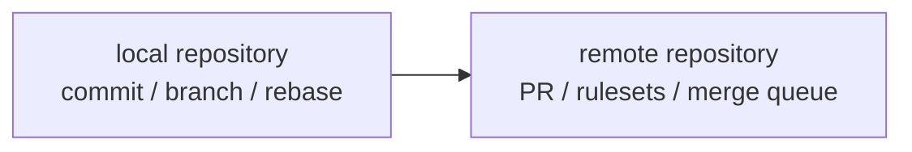
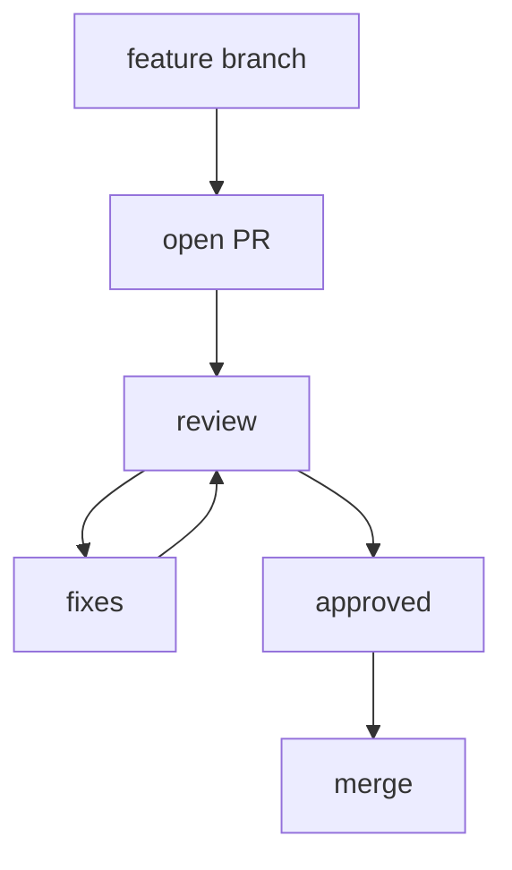
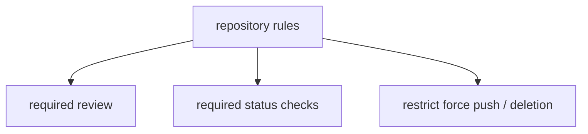
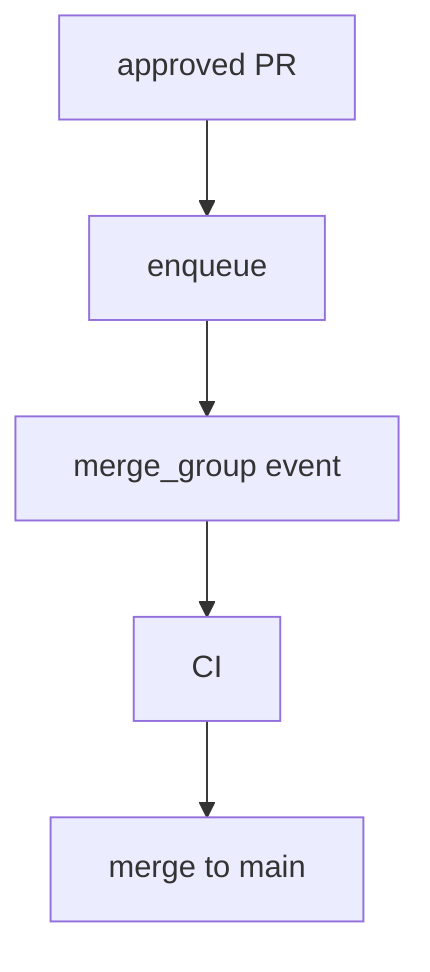
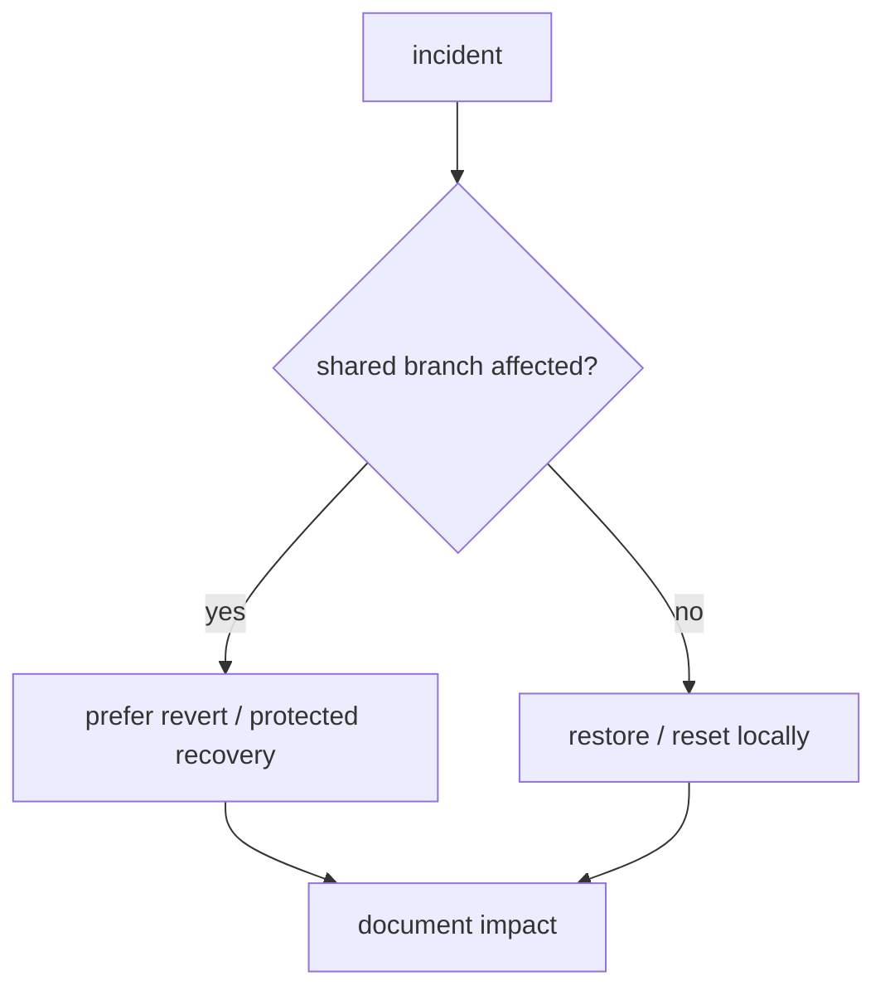

# Figure Roughs

## 図1-1 Git と GitHub の役割分担

## 表3-1 ブランチ戦略の比較

| 戦略 | 向いている場面 | 注意点 |
| --- | --- | --- |
| trunk-based | 小さく頻繁にマージするチーム | CI とレビュー速度が重要 |
| release branch | リリース準備が必要なチーム | 分岐後の差分管理が増える |
| 長寿命ブランチ | 明確な段階運用がある組織 | 競合と乖離が増えやすい |

## 図4-1 Pull Request の流れ

## 表5-1 `merge` `rebase` `cherry-pick` `revert` の使い分け

| 操作 | 主な用途 | 共有ブランチでの注意 |
| --- | --- | --- |
| `merge` | 履歴を保った取り込み | 比較的安全 |
| `rebase` | 履歴整理、追従 | 公開履歴では慎重に扱う |
| `cherry-pick` | 特定コミットだけ取り込む | 文脈を失いやすい |
| `revert` | 共有履歴上で打ち消す | 復旧時の第一候補になりやすい |

## 図6-1 rulesets と保護設定の位置づけ

## 図7-1 merge queue と CI の流れ

## 表9-1 タグ、リリース、バージョンの役割

| 要素 | 役割 | 混同しやすい点 |
| --- | --- | --- |
| タグ | 特定コミットへの印 | 説明文は薄いことがある |
| リリース | 公開単位と説明 | タグと 1 対 1 とは限らない |
| バージョン | 互換性の約束 | 名前と運用ルールを別で持つ必要がある |

## 図10-1 事故発生から復旧までの判断フロー

## 表11-1 運用ルール定着チェックリスト

| 観点 | 確認項目 |
| --- | --- |
| 履歴 | 変更単位が大きすぎないか |
| レビュー | PR テンプレートがあるか |
| 保護設定 | 必須チェックとレビューが一致しているか |
| 復旧 | 誰がどの操作をしてよいか共有されているか |
