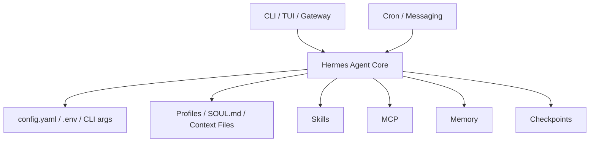

# 1章 Hermes Agent をどう捉えるか

Hermes Agent を最初に触ったとき、多くの人は「CLI から話しかけられて、コードも触れる便利な AI エージェント」と理解します。その理解は半分正しく、半分足りません。実務で本当に効いてくるのは、1 回の応答の賢さより、`設定` `権限` `文脈` `外部接続` `長時間運用` をどう束ねるかです。本書では Hermes Agent を、単なる会話相手ではなく、継続運用の対象として見ます。全体像は図1-1も合わせて確認してください。

## 図1-1 Hermes Agent の構造

Hermes Agent を 1 つの対話画面ではなく、複数層の運用基盤として見るための図です。どこで設定し、どこで文脈を持ち、どこで外部能力や常駐運用が入るかを先に見ておくと、このあとの章が追いやすくなります。

## 1-1. なぜ「会話相手」ではなく「運用基盤」として見るのか

単発の利用だけなら、多少雑な設定でも動いてしまうことがあります。都度 `--model` を変え、`--skills` を足し、広い権限のまま小さなタスクをこなす。これでも短期的には役に立ちます。しかし、継続利用になると事情が変わります。

継続利用で問われるのは、次の4点です。

- 同じ依頼に対して、だいたい同じ入口を使えるか
- どこまで書き込みを許すかを説明できるか
- 失敗時に何を見ればよいかが分かるか
- 更新後に何を点検すべきかが整理されているか

Hermes Agent は CLI、Skills、MCP、Profiles、Memory、Gateway、Cron までを持つため、ここを曖昧にしたまま広げると、機能の豊富さがそのまま複雑さになります。だから本書では、まず「何ができるか」より「どの層で何を決めるか」を先に整理します。

## 1-2. Hermes Agent を構成する4つの層

Hermes Agent を理解するとき、本書では次の4層で見ることを勧めます。

1. 入口
   - CLI
   - TUI
   - Gateway 経由の messaging
2. 設定
   - `config.yaml`
   - `~/.hermes/.env`
   - CLI 引数
3. 文脈と手順
   - Profiles
   - `SOUL.md`
   - Context Files
   - Skills
4. 外部能力と運用
   - MCP
   - Memory / Memory Providers
   - Checkpoints
   - Cron
   - logs と approvals

この分け方の利点は、問題の場所を絞りやすいことです。たとえば「同じ依頼なのに今日は挙動が違う」と感じたとき、model の問題なのか、profile の違いなのか、`config.yaml` と CLI 引数の衝突なのか、MCP や Memory の影響なのかを切り分けやすくなります。全部を「エージェントが賢いかどうか」の話にしてしまうと、設定事故と推論の揺れを同じ問題として扱ってしまいます。

## 1-3. 単発利用と継続運用の境界

単発利用では、多少の揺れは人間が吸収できます。ところが継続運用では、揺れがそのまま負債になります。毎回少し違う依頼文、少し違う起動オプション、少し違う profile。これが積み重なると、成功した理由も失敗した理由も蓄積しません。

本書では、継続運用へ進む条件として、少なくとも次を求めます。

- 同種の仕事に対して依頼の型がある
- profile ごとの責務を言葉にできる
- `config.yaml` `.env` CLI 引数の役割分担が固まっている
- 外部能力を足す前に、止め方と戻し方を説明できる

つまり、Hermes Agent の強みは「何でも自律的にこなすこと」ではなく、「使い方を構造化できること」にあります。

## 1-4. 通しサンプル `ForgeFlow`

本書では `ForgeFlow` という通しサンプルを使います。`ForgeFlow` は、小規模な開発チームで Hermes Agent を `coder` `triage` `ops` の3 profileに分けて運用する想定例です。全体像は付録Aも参照してください。

- `coder`
  - コード変更
  - テスト失敗の読み取り
  - 差分の保守性確認
- `triage`
  - Issue 整理
  - チケット要約
  - changelog 下書き
- `ops`
  - 定期監視
  - 依存更新候補の整理
  - Gateway / Cron を使った長時間運用

この題材を使う理由は、単なるサンプルコードではなく、責務分離と能力追加の順番を追えるからです。最初は CLI と最小設定だけで始め、必要になってから Skills、MCP、Memory、Cron を追加します。「最初から何でも使う」のではなく、「どこで止めるべきか」を確認するための題材です。

## 1-5. 本書で扱うことと扱わないこと

本書で主に扱うのは、比較的古びにくい運用判断です。

- 設定ファイルの置き方
- 秘密情報の分離
- profile の切り方
- MCP の足し方
- 常駐運用へ広げる条件
- 事故時の止め方と戻し方

一方で、次のものは主役にしません。

- 一時的な UI の見た目
- 画面上の細かな導線
- 内部実装の未公開フラグ
- その日にしか通用しない小技

Hermes Agent は更新が速いので、見た目や操作線だけに依存した説明は寿命が短くなります。だから本書では、画面の形より、設定の優先順位、責務分担、観測点、切り戻しのほうを優先します。

## 1-6. この章のまとめ

この章の結論は単純です。Hermes Agent は「賢い AI を呼ぶ入口」ではなく、「設定、権限、文脈、外部能力、常駐運用を束ねる基盤」として見たほうが、実務での判断がしやすくなります。次の章では、その土台になる `~/.hermes/` の構造、`config.yaml` と `.env` の役割、CLI 引数との優先順位を具体的に見ていきます。
