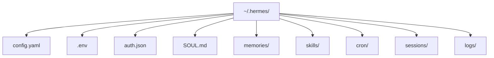

# 2章 インストール、ディレクトリ構造、最初の設定

Hermes Agent の導入で本当に大切なのは、インストール手順そのものではありません。どの model を使うか、どの provider を選ぶか、秘密情報をどこへ置くか、作業ディレクトリをどこへ固定するか、そして何を CLI 引数で一時的に上書きするかです。インストールは数分で終わっても、設定の責務分担を曖昧にしたまま運用を始めると、あとで必ず迷います。`~/.hermes/` の構造は図2-1、設定の優先順位は表2-1を合わせて見てください。

## 図2-1 `~/.hermes/` 配下の構成



導入時に「どのファイルがどの責務を持つか」を一目で整理するための図です。実際の運用ではここに profile ごとの文脈や補助ファイルが増えますが、まずはこの幹を押さえるだけで切り分けがかなり楽になります。

## 表2-1 設定の優先順位と置き場所

| 層 | 代表例 | 役割 |
| --- | --- | --- |
| CLI 引数 | `--model` `--provider` `--skills` | その回だけの上書き |
| `config.yaml` | `model` `terminal.cwd` `memory.provider` | 非secret の既定値 |
| `.env` | API key、token | secrets |
| built-in defaults | timeout など | 最終 fallback |

この表は、本書全体を通して何度も戻る基準です。どの値をどこへ置くかで迷ったら、まずこの4層へ戻るのが近道です。

## 2-1. 2026年5月14日時点での公式導入経路

2026年5月14日時点の公式 docs では、Hermes Agent は CLI を中心に使い始める導線が明確です。この段階で重要なのは、最初から Gateway や Cron まで広げないことです。導入直後は、ローカルの CLI で profile と provider の組み合わせを確認し、基本的な tool 権限と作業ディレクトリの感覚をつかむだけで十分です。

初回導入で見るべきなのは、インストール成功そのものではなく、次のような観点です。

- `config.yaml` がどこに置かれるか
- `.env` がどこにあり、何を入れるか
- どの provider が既定になるか
- shell 実行がどこから始まるか
- 更新時に `config check` や `migrate` で何を補えるか

## 2-2. `~/.hermes/` 配下の基本構造

実務で最初に意識したいのは、`~/.hermes/` 配下の役割分担です。

- `config.yaml`
  - 非secret の既定設定
- `.env`
  - API key、token、password
- `auth.json`
  - OAuth provider の認証状態
- `SOUL.md`
  - 長く維持したい行動原則
- `memories/`
  - persistent memory
- `skills/`
  - 再利用可能な手順
- `cron/`
  - 定期実行ジョブ
- `sessions/`
  - Gateway session
- `logs/`
  - 障害調査用ログ

この構造を先に理解しておくと、何か起きたときに「設定の問題か」「認証の問題か」「memory の問題か」を切り分けやすくなります。特に `config.yaml` と `.env` を混ぜないことが大切です。

## 2-3. 設定の優先順位

設定解決の順序は次のとおりです。

1. CLI 引数
2. `~/.hermes/config.yaml`
3. `~/.hermes/.env`
4. built-in defaults

この順序は、本書全体を通して最重要の前提です。実務での覚え方はシンプルです。

- 秘密情報は `.env`
- 非秘密の既定値は `config.yaml`
- その回だけの変更は CLI 引数

たとえば `hermes chat --model ...` は、その回だけ model を変える一時上書きです。普段の既定値は `config.yaml` に置きます。API キーや bot token は `.env` に置きます。これを逆にすると、「設定を変えたのに効かない」「別の profile だけ違う値が効いている」といった事故が起きやすくなります。

## 2-4. 最小構成で先に動かす

最初から高度な構成へ進まず、最小構成で先に感覚をつかむほうが安全です。

```yaml
model: anthropic/claude-sonnet-4

terminal:
  backend: local
  cwd: /absolute/path/to/project
  timeout: 180
```

`.env` には provider の API キーだけを置きます。

```env
ANTHROPIC_API_KEY=...
```

この段階で見るべきことは次です。

- `terminal.cwd` が意図した場所を向くか
- 期待した provider へ出ているか
- `--model` や `--provider` で一時的に切り替えられるか
- local backend の広さを理解しているか

CLI で安定しないうちに Docker backend や SSH backend へ広げると、問題の所在が分かりにくくなります。

## 2-5. 最初の profile は小さく始める

導入直後の profile は、広く作らないほうがよいです。`ForgeFlow` では `coder` から始めますが、ここでいう `coder` は「何でもする profile」ではありません。読み取りと小さな修正提案を中心にした狭い責務の profile です。

最初の profile で避けたいのは次のような構成です。

- 広いリポジトリ全体へ書き込み可能
- いきなり複数 provider を切り替える
- Memory と MCP を同時に足す
- Cron や Gateway まで一気に有効化する

導入直後に欲しいのは能力の幅ではなく、「どの仕事なら安心して任せられるか」という感覚です。

## 2-6. 導入直後によくある詰まり方

導入直後の失敗は、たいてい次のどれかです。

1. API キーはあるのに provider が違う
2. `config.yaml` に入れたつもりの値が CLI 引数で上書きされている
3. `terminal.cwd` が曖昧で、意図しない場所を見ている
4. `SOUL.md` や profile の責務を決める前に Skill や MCP を足している
5. local backend で広い権限を持ったまま安全だと思い込む

この章の段階で大事なのは、全部を解決することではありません。どこで設定を持ち、どこで責務を分け、どこで一時上書きを行うかを明確にすることです。細かな項目は、`model` `terminal` `browser` などの中核キーを付録D、表示や memory まわりを付録E、起動時だけ効く env / CLI 上書きを付録Hで一覧化しているので、本文では原則を優先します。

## 2-7. この章のまとめ

導入初期で固めるべきなのは、インストール方法より、`~/.hermes/` の構造、設定の優先順位、最小構成、最初の profile の責務です。ここが固まっていれば、あとで provider、Skills、MCP、Cron を増やしても壊れにくくなります。次の章では、model、provider、terminal backend、approval をまとめて扱い、「賢い構成」より「壊れにくい構成」をどう作るかを見ます。
