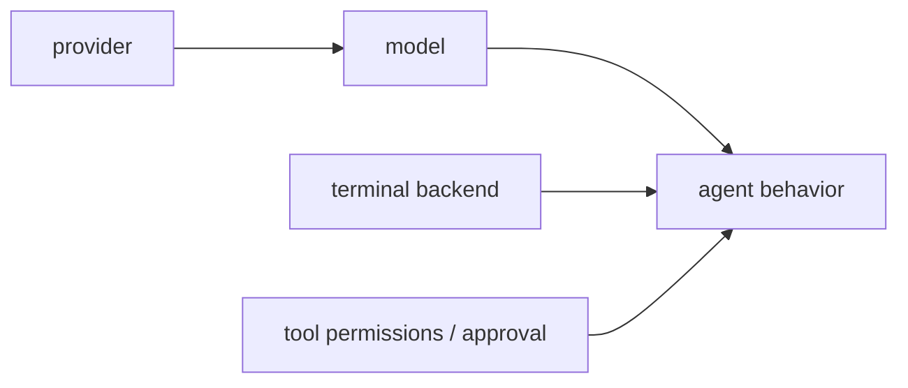

# 3章 モデル、プロバイダ、権限設計

Hermes Agent を使い始めると、つい model 選びに意識が寄りがちです。どの model が賢いか、どの provider が安いか、どの組み合わせが速いか。もちろんそれも大事ですが、実務で事故を減らすのは model の強さより、provider 設定と権限設計の分離です。同じ model でも、作業ディレクトリ、terminal backend、approval policy が違えば安全性も再現性も大きく変わります。全体の関係は図3-1、よく触る値の置き場所は表3-1を参照してください。

## 図3-1 model、provider、tool permissions の関係

同じ model でも、backend や approval が違えば実務上の意味は大きく変わります。賢さと安全性をひとつの軸で語らないための図です。

## 表3-1 よく触る設定と秘密情報の分け方

| 代表値 | 置き場所 |
| --- | --- |
| `model` `terminal.cwd` `skills` | `config.yaml` |
| API key、bot token | `.env` |
| 一時的な model 切替 | CLI 引数 |

この切り分けを守るだけで、provider 切り替え実験と恒久設定の混線をかなり防げます。

## 3-1. model と provider は別の論点

model は推論能力の話で、provider はその model をどこからどう呼ぶかの話です。Hermes Agent では、provider ごとに認証方式、base URL、routing、timeout の持ち方が異なります。ここを分けずに「この model は良い」「この provider は遅い」と話すと、原因を誤認しやすくなります。

provider 側にある論点は、たとえば次のようなものです。

- API key や OAuth
- base URL
- request timeout
- stale timeout
- routing
- model ごとの override

実務でまず見るべきなのは、`一度動いた` ことではありません。`同じ profile で再現するか` と `provider を差し替えても責務境界が崩れないか` です。

## 3-2. provider ごとの値をどこへ置くか

provider まわりで迷いやすいのは、秘密情報と設計判断の混在です。本書では次のように分けます。

- `.env`
  - API key
  - bot token
  - secret な接続情報
  - observability credentials
- `config.yaml`
  - 既定 provider
  - 既定 model
  - timeout
  - routing
  - auxiliary model の選択
- CLI 引数
  - 検証時の一時切り替え

たとえば provider 切り替えの実験をするとき、毎回 `config.yaml` を編集していると、何が恒久設定で何が検証条件なのか分かりません。逆に、恒久設定まで `--model` `--provider` へ寄せると再現性が落ちます。

## 3-3. `terminal.backend` と `terminal.cwd` は安全性の中心

2026年5月14日時点の公式 docs では、`local` `docker` `ssh` `modal` `daytona` `vercel_sandbox` `singularity` などの backend が紹介されています。ここで大事なのは backend の豪華さではなく、責務に合った隔離度を選ぶことです。

- `local`
  - 速い
  - その代わりユーザー権限で広く触れる
- `docker`
  - 再現性と隔離のバランスが良い
- `ssh`
  - リモート資源を活かせる
  - 接続先管理が増える
- cloud sandbox 系
  - 分離は強い
  - 認証や永続化の設計が増える

どの backend でも `terminal.cwd` は重要です。CLI では launch dir に救われることがあっても、Gateway や Cron では `terminal.cwd` の明示が効く場面が増えます。ここが曖昧だと、CLI では正しく見えるのに Cron だけ別の場所を見ている、という事故が起きます。

## 3-4. 権限は能力ではなく責任の境界

Hermes Agent の権限設計で最も重要なのは、広い権限を与えることではなく、責任を小さく閉じることです。

- `coder`
  - 対象ディレクトリ内の読み書き
  - テスト実行
- `triage`
  - issue 読み取り
  - 要約
- `ops`
  - cron
  - notification
  - 限定的な運用確認

このとき profile を sandbox と勘違いしないことが大切です。安全性は、profile 名ではなく、toolset、作業ディレクトリ、approval、backend、secrets の置き方で作られます。

## 3-5. approval をどこへ入れるか

approval は、Hermes Agent を信用していないから入れるのではありません。人間と agent の責任境界を明示するために入れます。特に次の場面では approval を強く検討する価値があります。

- ファイル変更
- 外部投稿
- 広い shell 実行
- credential に触れる可能性がある操作
- 常駐運用からの自動変更

一方で、読み取りや要約のようなタスクでは approval を細かく挟みすぎると、運用負荷ばかり増えます。全部を止めるのではなく、「ここを越えるなら人間が見る」という線を言葉にすることが重要です。

## 3-6. よくある失敗

この章の設計を飛ばすと、次のような失敗が起きやすくなります。

- provider を変えたら安全になると誤解する
- local backend のまま広い書き込み権限を与える
- `terminal.cwd` を決めずに Cron へ進む
- secrets を `config.yaml` へ混ぜる
- approval を後付けして、どこまで止めるべきか説明できない

`ForgeFlow` では、まず `coder` を local backend で小さく動かし、責務が固まってから `ops` に長時間運用を足します。この順番を逆にしないことが大切です。

## 3-7. この章のまとめ

この章の要点は、model の強さより、provider 設定、backend、approval、作業範囲の設計が重要だということです。`model` `providers` `terminal` `auxiliary` は付録D、承認やセキュリティは付録F、互換キーや `mcp_servers` のような動的項目は付録G、起動時の上書きは付録Hで引けるようにしてあります。次の章では、その権限設計を前提に、CLI をどう日常運用へ落とし込むかを見ていきます。
