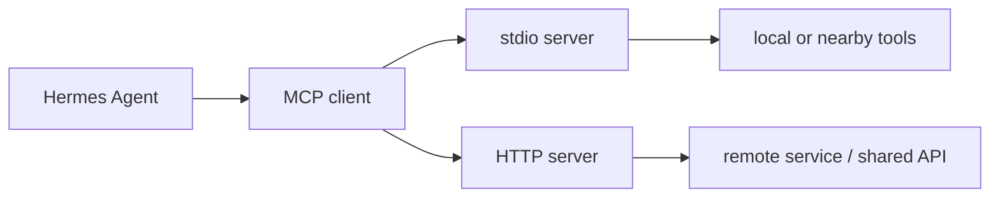

# 6章 MCP 連携の設計と運用

Hermes Agent の魅力のひとつは、MCP を通じて外部能力を明示的に追加できることです。GitHub、ブラウザ、外部 API、社内ツールのように、agent が単独では持たない能力を安全に接続できるのは大きな強みです。ただし、MCP は便利なぶんだけ、設定、認証、障害切り分け、責務分担を一気に難しくします。接続イメージは図6-1、主要フィールドは表6-1も参照してください。

## 図6-1 MCP で能力を足す流れ



`stdio` と `HTTP` では、認証の置き場所も障害時の見方も変わります。MCP を「何か外部につながるもの」と一括りにしないための図です。

## 表6-1 `mcp_servers` の主要フィールド

| フィールド | 使いどころ |
| --- | --- |
| `command` | `stdio` server 起動 |
| `args` | 起動引数 |
| `env` | server へ渡す secret / env |
| `url` | `HTTP` server 接続先 |
| auth | OAuth / header |

この表は、`mcp_servers` を見たときに最初に目を通すチェックリストとして使えます。

## 6-1. MCP を足す前に見るべきこと

MCP を追加したくなる理由はたいてい正しいです。ファイルだけでは足りない、GitHub の issue を直接読みたい、ブラウザから情報を引きたい、社内サービスへ接続したい。しかし、追加前に少なくとも次の問いへ答えられる必要があります。

- その能力は本当に agent に持たせる必要があるか
- profile ごとに同じ能力が必要か
- 障害時に切り離しても運用が続くか
- 認証情報の置き場所は明確か
- 接続状態をどこで確認するか

この問いへ答えられないうちは、MCP を足すより先に CLI と Skill の設計を見直したほうが効果的なことが多いです。

## 6-2. `stdio` と `HTTP` の違い

2026年5月14日時点の公式 MCP Config Reference では、MCP server は大きく `command` ベースと `url` ベースに分けて考えられます。本書では便宜上、前者を `stdio` 型、後者を `HTTP` 型として整理します。

- `stdio`
  - Hermes がローカルまたは周辺環境でプロセスを起動する
  - `command` `args` `env` が中心
  - ローカルツール連携と相性が良い
- `HTTP`
  - 既存サーバーへ接続する
  - `url` と auth が中心
  - 共有サービスや遠隔連携と相性が良い

この違いは単なる接続方法の差ではありません。障害時の見方、credential の置き場所、再起動責任、ログの観測点まで変わります。

## 6-3. `mcp_servers` の主要フィールド

実務でまず押さえるべき `mcp_servers` のフィールドは、次のとおりです。

- `command`
- `args`
- `env`
- `url`
- auth 関連設定

たとえば `stdio` 型なら、最小構成は次のようになります。

```yaml
mcp_servers:
  github:
    command: npx
    args:
      - -y
      - "@modelcontextprotocol/server-github"
    env:
      GITHUB_PERSONAL_ACCESS_TOKEN: ${GITHUB_TOKEN}
```

ここで見たいのは書式そのものより、「secret は `.env` へ、server の構成は `config.yaml` へ」という原則です。

## 6-4. `hermes mcp` コマンドをどう使うか

公式 docs では、`hermes mcp add` `list` `test` `configure` `login` などのサブコマンドが用意されています。運用上、とくに価値が高いのは次です。

- `add`
  - 初期追加
- `list`
  - 現在の定義確認
- `test`
  - 接続確認
- `configure`
  - 再設定
- `login`
  - 認証補助

商用本として重要なのは、「足せること」ではなく「壊れたときにどこを見るか」です。

## 6-5. 失敗例と切り分け

MCP を使い始めると、よくある失敗はだいたい次のどれかです。

- 認証情報はあるが、profile から見えていない
- `stdio` server が起動しているつもりで、実際には path や package 解決で失敗している
- `HTTP` server の URL は合っているが、auth header が足りない
- toolset 側で期待した tool が無効
- 複数の MCP を足しすぎて、どの server で何をするのか説明できない

切り分けでは、次の順番が実務的です。

1. server 定義が想定どおりか
2. 認証情報が正しい場所にあるか
3. network / process の起動自体に失敗していないか
4. profile や toolset 側で見えていないだけではないか

## 6-6. MCP を増やしすぎたときの運用負債

MCP が1台増えるごとに、認証、可用性、監視、更新点検の責任も増えます。MCP を能力追加と同時に運用負債追加として見ることが重要です。

`ForgeFlow` でも、最初から多くの MCP は足しません。GitHub を追加するなら、それは `triage` や `ops` の責務に関係するからであり、`coder` にまで同じ能力を開く必要があるとは限りません。

## 6-7. この章のまとめ

MCP は Hermes Agent の強い拡張点ですが、何でも足せばよいわけではありません。能力を足す前に、責務、認証、観測点、切り離し方を整理することが必要です。`mcp_servers.<name>.*` の完全表は付録G、最小構成や安全な追加断片は付録Cを参照してください。次の章では、その責務分離を支える Profiles、`SOUL.md`、Context Files をまとめて扱います。
