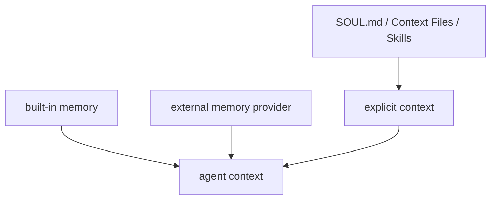

# 8章 Memory と文脈の持続

AI エージェントを継続利用すると、必ず「覚えていてほしい」という欲求が生まれます。毎回同じ前提を説明したくない、以前の判断を踏まえてほしい、チームの流儀を引き継いでほしい。その気持ちは自然ですし、Hermes Agent の memory は確かに便利です。ただし、memory は便利さと引き換えに、見えにくい状態を増やします。文書と memory の関係は図8-1も参照してください。

## 図8-1 built-in memory と external providers の関係

文書と memory は競合ではなく役割分担です。ここを図で見ておくと、「何でも memory に入れる」誤りを避けやすくなります。

## 8-1. built-in memory の役割

Hermes Agent には built-in の memory 層があります。これは、長い会話や継続利用の補助として有効ですが、万能な設計置き場ではありません。本書では、built-in memory を `短中期の補助状態` として扱うことを勧めます。

向いているもの:

- 直近の作業文脈
- 継続中の小さな前提
- 会話をまたいだ短期メモ

向かないもの:

- リポジトリの恒久ルール
- profile ごとの行動原則
- 毎回再利用したい作業手順

## 8-2. external memory providers が必要になる場面

外部 provider が向きやすい場面:

- 複数チャネルから同じ state を参照したい
- 長時間運用で共有したい短期状態がある
- session を越えて薄い文脈を残したい

向きにくい場面:

- ルール文書の置き換え
- 監査が必要な重要判断の保存先
- 削除ルールが曖昧な情報の長期保存

memory provider を足すということは、agent の内部便利機能を増やすだけでなく、外部状態を持つシステムに一歩近づくという意味です。

## 8-3. 何を覚えさせ、何を文書へ残すか

この章で最も重要なのは、memory と文書の役割分担です。

- 原則や恒久ルール
  - `SOUL.md`
  - Context Files
- 再利用可能な手順
  - Skills
- 短期的な状態
  - memory
- 後で人間が説明責任を負う判断
  - issue や document、明示的なログ

memory は「便利だから何でも入れる」場所ではありません。便利さより説明可能性が重要な情報は、文書へ残したほうがよいです。

## 8-4. 小さな保持方針を先に作る

memory を実務で使うなら、先に「何を入れないか」を決めるほうが安全です。たとえば `ForgeFlow` なら、次のような保持方針が考えられます。

- memory に入れてよい
  - 直近の作業対象
  - 一時的な調査メモ
  - session をまたいで必要な短い引き継ぎ
- memory に入れない
  - review ルール
  - issue の恒久運用
  - secret や credential
  - 人間が後で監査したい判断

この種の「入れない一覧」を先に作っておくと、便利さに引っ張られて memory を肥大化させにくくなります。

## 8-5. 誤記憶と削除方針

memory の難しさは、覚えることより忘れさせることにあります。誤ったことを覚えた、古い前提が残っている、もはや不要な情報が残っている。このとき、どこでそれを確認し、どう修正し、どう削除するのかが決まっていないと、運用は不安定になります。

- memory をどの頻度で点検するか
- 誤記憶が疑われたとき何を優先して確認するか
- 文書へ戻すべき情報をどの条件で見直すか
- external provider 側の可用性が落ちたときどう縮退するか

## 8-6. この章のまとめ

memory は強い機能ですが、設計不足を隠す場所にしてはいけません。`ForgeFlow` でも、issue 運用ルールやレビュー観点は memory に置かず、短期状態だけを薄く持たせます。次の章では、状態を持つ運用のもうひとつの安全装置として、Checkpoints と rollback を変更管理の文脈で見ていきます。
