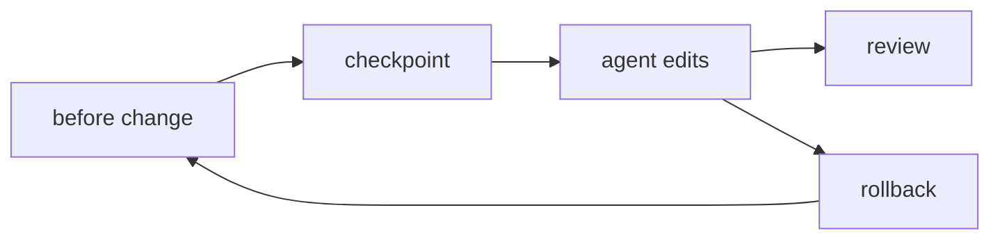

# 9章 Checkpoints、変更管理、ロールバック

Hermes Agent がファイルを触るようになると、便利さと同時に不安も増えます。どこまで書き換わったか、意図しない変更が混ざっていないか、壊したときにどう戻すか。ここで効いてくるのが Checkpoints です。ただし、Checkpoints は「安心ボタン」ではありません。エージェント作業の変更管理機能として捉えたほうが、実務ではずっと役に立ちます。全体の流れは図9-1も参照してください。

## 図9-1 Checkpoints と rollback の流れ

この図が示しているのは、Checkpoints が Git の代わりではなく、エージェント作業の短い時間軸を支えることです。

## 9-1. どのタスクで Checkpoints を使うか

Checkpoints を有効にする価値が高いのは、次のような場面です。

- 複数ファイルをまたぐ修正
- 設定変更
- 自動整形や大きな書き換え
- 長時間タスクの途中変更
- 人間が後で review する前提の差分作成

逆に、読み取りだけの仕事では毎回 checkpoint を切る必要はありません。運用コストと戻しやすさのバランスで考えるべきです。

## 9-2. Git と Checkpoints の役割分担

この章で重要なのは、Git と Checkpoints を競合させないことです。

- Git
  - 履歴
  - review
  - branch
  - revert
- Checkpoints
  - エージェント作業直前の退避
  - 途中の巻き戻し
  - task 単位の短い保険

つまり、Checkpoints は Git を置き換えるものではありません。エージェントが作業している最中に「一段前へ戻る」ための仕組みです。

## 9-3. rollback の前後で何を確認するか

`rollback` があるから安全、とは言い切れません。戻したあとに何を確認するかが決まっていないと、見かけ上だけ戻って実害が残ることがあります。少なくとも次は見たいところです。

- 対象ファイルが本当に戻っているか
- 意図しない副作用が残っていないか
- 外部状態を伴う操作が途中で走っていないか
- どの時点まで戻ったのかを説明できるか

特に Gateway や Cron と結びつく運用では、ファイルだけでなく通知や外部投稿が絡むことがあります。Checkpoints はファイル側の戻しを助けますが、外部状態まで自動で解決してくれるわけではありません。

## 9-4. rollback の訓練を先にやる

Checkpoints は、必要になったとき初めて触るより、早い段階で一度試しておくほうが強いです。実際に戻してみると、次のような確認点が見えてきます。

- どこまで戻るのか
- 自分の review 手順と噛み合うか
- ログや外部投稿の復旧は別に必要か
- 人間へ報告すべき単位はどこか

本番に近い運用へ広げる前に、1 回は小さな変更で rollback を試しておくと、いざというときに慌てにくくなります。

## 9-5. 変更単位の切り方

Checkpoints が有効でも、変更単位が粗すぎると戻しにくくなります。反対に細かすぎると運用が重くなります。本書では次の感覚を勧めます。

- 1 つの依頼で 1 つの目的
- 大きな整形と意味的変更を分ける
- 設定変更とコード変更を混ぜすぎない
- review しやすい大きさで止める

これは Git の差分設計と似ていますが、Hermes Agent ではより重要です。AI エージェントは一度に広く触れやすいからです。

## 9-6. この章のまとめ

Checkpoints は、広い修正を許すための免罪符ではなく、小さく切って戻しやすくするための安全装置です。`ForgeFlow` でも、`coder` がファイル変更を伴う仕事をする前には checkpoint を前提にします。次の章では、その変更管理の感覚を持ったうえで、Gateway と Cron による長時間運用へ進む条件を見ます。
