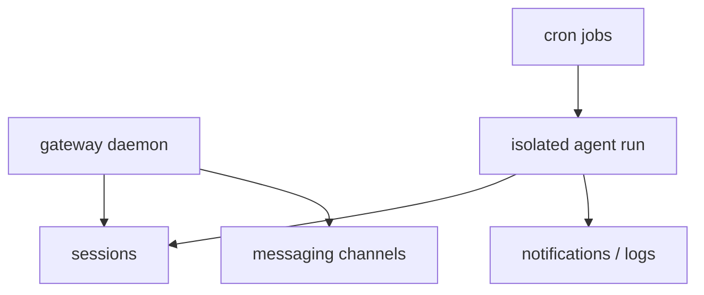

# 10章 Gateway、Cron、常駐運用

CLI で Hermes Agent が役立ち始めると、次に気になるのが常駐運用です。チャット経由で使いたい、定期的に監視したい、未対応 issue を見回らせたい。Gateway や Cron は、その欲求に応える仕組みです。ただし、この段階に入ると、Hermes Agent は個人の補助ツールから半ば運用システムへ変わります。ここで必要なのは、便利さより運用設計です。全体の関係は図10-1、常駐化前の確認は表10-1も参照してください。

## 図10-1 Gateway と Cron の長時間運用

Gateway と Cron を別々の便利機能としてではなく、常駐運用の層としてまとめて理解するための図です。

## 表10-1 常駐運用へ進む前のチェックリスト

| 確認項目 | 見る理由 |
| --- | --- |
| CLI で同種の依頼が安定している | 不安定な手順を自動化しない |
| 停止条件がある | 失敗時に被害を広げない |
| 通知先がある | 失敗に気づける |
| 対象 profile が明確 | 責務を混ぜない |

この表のどれかに答えられないなら、まだ常駐化は早いと考えるのが安全です。

## 10-1. CLI から常駐運用へ進む条件

本書では、次の条件を満たしてから常駐運用へ進むことを勧めます。

- CLI で同種の依頼が安定している
- profile ごとの責務が明確
- 主要な Skill が固定されている
- どの設定を `config.yaml` へ置くか整理できている
- 停止条件と通知先を説明できる

この条件を満たさないまま常駐化すると、問題は拡大します。

## 10-2. Gateway の役割

Gateway は、単に複数チャネルから触れるための入口ではありません。sessions、messaging、認証、利用者制御、常駐プロセスとしての観測点を持つ運用層です。

Gateway を入れると、次の問いが発生します。

- 誰が使えるのか
- どのチャネルから受け付けるのか
- どの profile が動くのか
- 途中状態を誰が見るのか
- どこへログを残すのか

CLI では呼び出した人がほぼ全責任を持てますが、Gateway では利用者、観測者、管理者が分かれやすくなります。

## 10-3. Cron の役割

Cron を導入するときに大事なのは、「何でも定期実行させる」ことではありません。何を agent に任せず、script-only の監視や固定ルールの検査へ留めるかを決めることです。

本書では Cron の仕事を大きく 3 つに分けます。

1. agent を伴う仕事
   - issue 棚卸し
   - 要約
   - review 補助
2. script-only の仕事
   - 疎通確認
   - 定型チェック
   - 単純な条件判定
3. 通知中心の仕事
   - 変化があったときだけ知らせる

全部を agent へ寄せることが高度なのではありません。agent を使う価値がある仕事だけを選ぶほうが、運用は強くなります。

## 10-4. `hermes cron` 系コマンドをどう見るか

2026年5月14日時点の公式 CLI docs では、`hermes cron` に `list` `create` `edit` `pause` `resume` `run` `remove` などの入口があります。本書で重視するのは、コマンドの数より `ジョブをどう設計するか` です。

よいジョブには次の特徴があります。

- 目的が 1 つ
- 停止条件がある
- 人間へ戻す出口がある
- 実行頻度に理由がある
- 失敗時に何を見ればよいかが分かる

## 10-5. 小さく始めるジョブの例

常駐運用の最初の 1 本として向いているのは、たとえば次のようなものです。

- 毎朝 1 回、stale issue を列挙する
- 依存更新 PR の候補だけを要約する
- 監視対象の変化があったときだけ通知する

逆に、最初の 1 本として避けたいのは、複数 repo をまたぐ大規模集約や、自動修正まで含んだジョブです。長時間運用では、成功体験より停止のしやすさを優先したほうがうまくいきます。

## 10-6. 長時間運用の観測点

常駐運用で最も怖いのは、「動いているように見えるが、誰も全体像を説明できない」状態です。Gateway や Cron を使うなら、少なくとも次の観測点を持ちたいところです。

- sessions の状態
- 実行ログ
- 失敗回数
- 再試行回数
- 通知先の反応
- 手動停止手順

## 10-7. この章のまとめ

CLI で安定しないものを常駐化しないこと、agent を使う仕事と使わない仕事を分けること、停止条件を先に決めること。この3つが守られていれば、Gateway と Cron は強い味方になります。messaging、cron、kanban まわりの設定完全表は付録F、起動時の handoff や process-level override は付録Hを参照してください。次の章では、その常駐運用を現実的に支えるためのセキュリティ、承認、事故対応を扱います。
