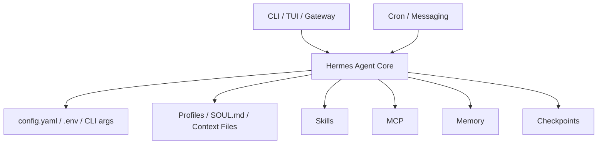
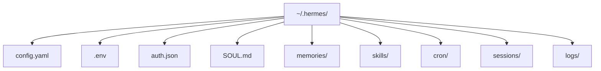
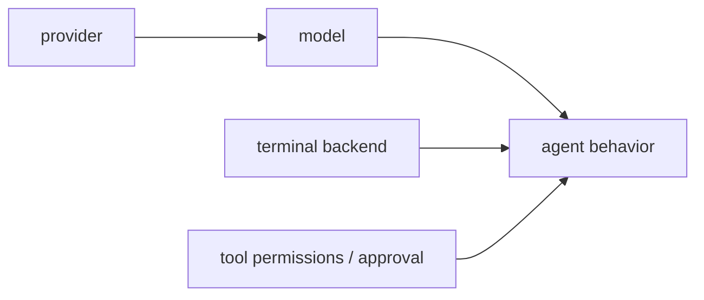
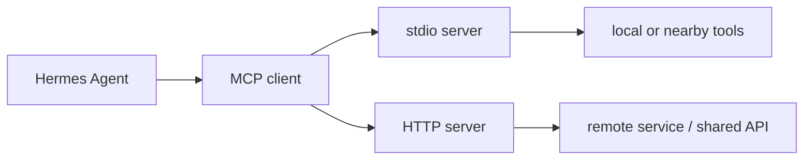
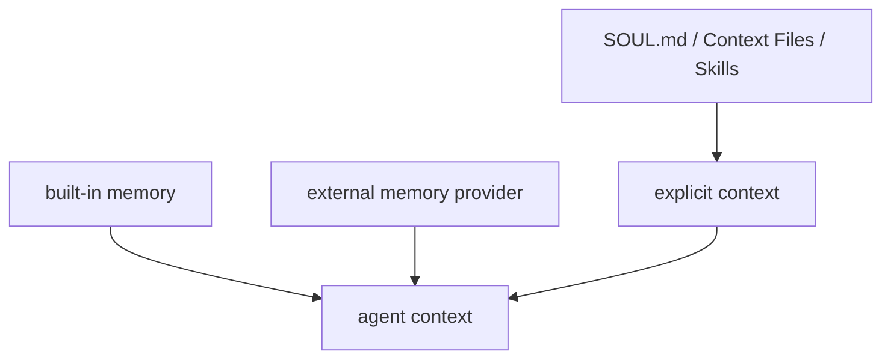
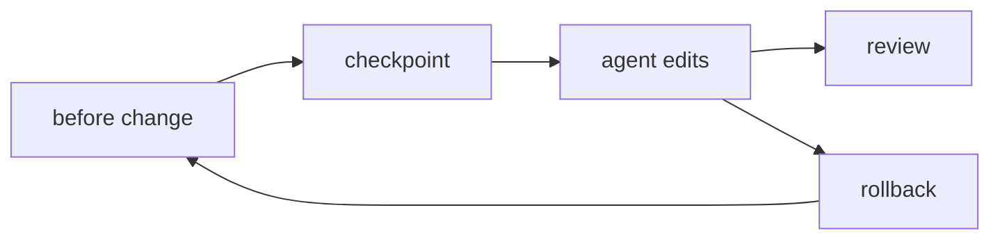
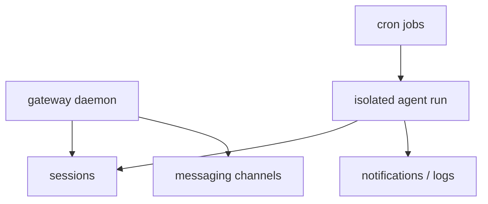

# Figures Final

## 図1-1 Hermes Agent の構造

- 図の意図: Hermes Agent を 1 回の会話ではなく、複数層の運用基盤として示す
- 本文への接続: 1章の全体像に対応する

## 図2-1 `~/.hermes/` 配下の構成

- 図の意図: 導入時に見るべき主要ファイルとディレクトリを一目で示す
- 本文への接続: 2章のディレクトリ構造説明に対応する

## 表2-1 設定の優先順位と置き場所

| 層 | 代表例 | 役割 |
| --- | --- | --- |
| CLI 引数 | `--model` `--provider` `--skills` | その回だけの上書き |
| `config.yaml` | `model` `terminal.cwd` `memory.provider` | 非secret の既定値 |
| `.env` | API key、token | secrets |
| built-in defaults | timeout など | 最終 fallback |

- 表の意図: どの値をどこへ置くかの原則を固定する
- 本文への接続: 2章の優先順位説明に対応する

## 図3-1 model、provider、tool permissions の関係

- 図の意図: model の賢さと権限設計が別の論点であることを示す
- 本文への接続: 3章の権限設計に対応する

## 表3-1 よく触る設定と秘密情報の分け方

| 代表値 | 置き場所 |
| --- | --- |
| `model` `terminal.cwd` `skills` | `config.yaml` |
| API key、bot token | `.env` |
| 一時的な model 切替 | CLI 引数 |

- 表の意図: 実務で迷いやすい値の置き場所を短く引けるようにする
- 本文への接続: 3章の設定責務分担に対応する

## 表4-1 `hermes chat` の主要引数

| 引数 | 主な用途 |
| --- | --- |
| `--model` | model 上書き |
| `--provider` | provider 上書き |
| `--skills` | skill 指定 |
| `--toolsets` | toolset 指定 |
| `--checkpoints` | checkpoint 前提 |
| `--ignore-user-config` | 切り分け |
| `--ignore-rules` | 切り分け |

- 表の意図: 日常利用で本当に使う引数だけを引けるようにする
- 本文への接続: 4章の CLI 運用に対応する

## 表5-1 Skill に切り出すべき手順の特徴

| 向いている手順 | 理由 |
| --- | --- |
| 同じ観点で繰り返すレビュー | 出力のぶれを減らせる |
| 調査手順が固定される仕事 | 会話履歴依存を減らせる |
| 複数ツールをまたぐ定型作業 | 手順を資産化できる |

- 表の意図: 何でも Skill 化しないための判断軸を渡す
- 本文への接続: 5章の Skill 設計に対応する

## 図6-1 MCP で能力を足す流れ

- 図の意図: MCP を足すときの接続形態と責務の違いを示す
- 本文への接続: 6章の連携設計に対応する

## 表6-1 `mcp_servers` の主要フィールド

| フィールド | 使いどころ |
| --- | --- |
| `command` | `stdio` server 起動 |
| `args` | 起動引数 |
| `env` | server へ渡す secret / env |
| `url` | `HTTP` server 接続先 |
| auth | OAuth / header |

- 表の意図: `mcp_servers` でまず見るべき項目を引けるようにする
- 本文への接続: 6章の設定説明に対応する

## 表7-1 Profiles、SOUL.md、Context Files の役割

| 要素 | 主な役割 | よくある誤解 |
| --- | --- | --- |
| Profile | 責務と権限の分離 | 人格分離そのものが安全性を作る |
| `SOUL.md` | 長く維持したい原則 | 毎回の依頼も全部書く |
| Context Files | project 固有の前提 | profile の代わりになる |

- 表の意図: 似て見える層を責務で分ける
- 本文への接続: 7章に対応する

## 図8-1 built-in memory と external providers の関係

- 図の意図: 文書と memory の役割を分けて理解しやすくする
- 本文への接続: 8章に対応する

## 図9-1 Checkpoints と rollback の流れ

- 図の意図: Checkpoints を短期の変更管理として示す
- 本文への接続: 9章に対応する

## 図10-1 Gateway と Cron の長時間運用

- 図の意図: 常駐運用では sessions、notifications、logs が増えることを示す
- 本文への接続: 10章に対応する

## 表10-1 常駐運用へ進む前のチェックリスト

| 確認項目 | 見る理由 |
| --- | --- |
| CLI で同種の依頼が安定している | 不安定な手順を自動化しない |
| 停止条件がある | 失敗時に被害を広げない |
| 通知先がある | 失敗に気づける |
| 対象 profile が明確 | 責務を混ぜない |

- 表の意図: Cron / Gateway を広げる前の最終確認を短く残す
- 本文への接続: 10章に対応する

## 表11-1 セキュリティと承認のチェックリスト

| 観点 | 確認項目 |
| --- | --- |
| secrets | `.env` や secret store に分離されているか |
| approval | 外部投稿と広い変更に境界があるか |
| logs | 残す情報と隠す情報が決まっているか |
| rollback | 変更前へ戻る導線があるか |
| long running | job を止める手順があるか |

- 表の意図: 導入前に最低限確認したい安全項目を残す
- 本文への接続: 11章に対応する

## 表12-1 Hermes / OpenCode / OpenClaw の比較

| ツール | 強み | 注意点 |
| --- | --- | --- |
| Hermes Agent | 設定、Profiles、Memory、Cron をまとめて設計しやすい | 更新が速く構成も広い |
| OpenCode | coding workflow 中心の体験に強い | 長時間運用や責務分離は別途見極めが必要 |
| OpenClaw | プラットフォームの広さ | 対象範囲が広く、導入設計が重くなりやすい |

- 表の意図: 機能数ではなく運用構造で比較する
- 本文への接続: 12章に対応する
