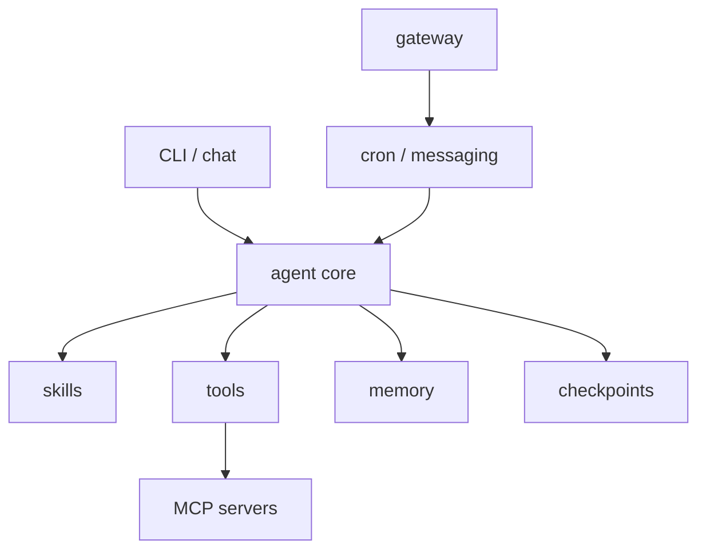
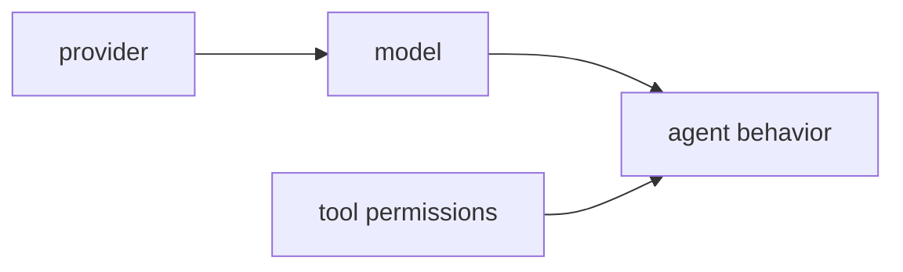
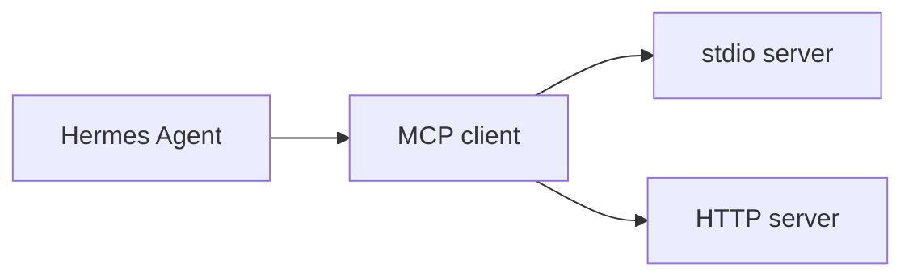
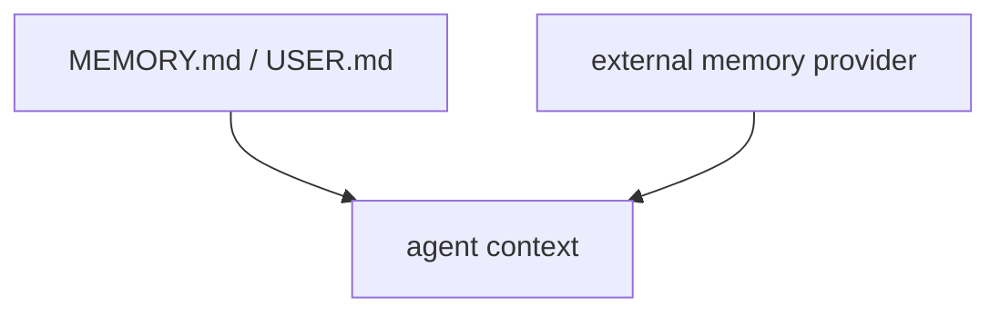
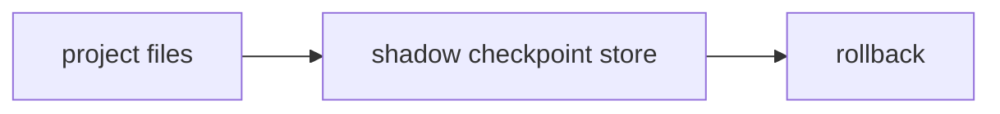
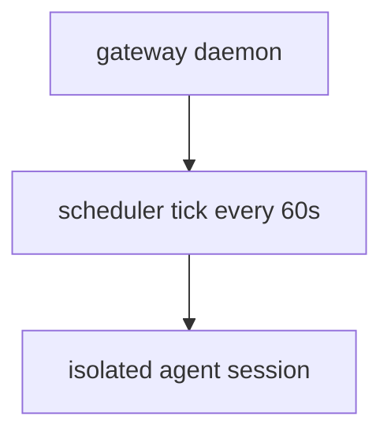

# Figures Final

## 図1-1 Hermes Agent の責務分解

- 図の意図: Hermes Agent を 1 つの対話画面ではなく運用基盤として見るための土台を示す
- 本文への接続: 1章の全体像に対応する

## 図3-1 モデル、プロバイダ、ツール権限の関係

- 図の意図: モデル選定と権限設計を別の判断として切り分ける
- 本文への接続: 3章の権限とプロバイダの整理に対応する

## 表5-1 Skill に切り出すべき手順の特徴

| 向いている手順 | 理由 |
| --- | --- |
| 繰り返し使う調査手順 | 毎回説明しなくてよくなる |
| 複数ツールをまたぐ作業 | 再現性が上がる |
| 判断基準を固定したい作業 | ぶれを減らせる |

- 表の意図: skill 化を便利さだけでなく再利用性で判断する
- 本文への接続: 5章の手順資産化に対応する

## 図6-1 MCP で能力を足す流れ

- 図の意図: Hermes 自前ツールと MCP 経由ツールの境界を示す
- 本文への接続: 6章の拡張設計に対応する

## 表7-1 Profiles、SOUL.md、Context Files の役割

| 要素 | 主な役割 | よくある誤解 |
| --- | --- | --- |
| Profile | state を分離する | sandbox ではない |
| `SOUL.md` | 行動方針を与える | filesystem を制限しない |
| Context Files | プロジェクト前提を渡す | profile の代わりではない |

- 表の意図: 混同されやすい 3 要素を責務で分ける
- 本文への接続: 7章の構成設計に対応する

## 図8-1 built-in memory と external providers の関係

- 図の意図: 外部 provider が built-in memory を置き換えるのではなく加算することを示す
- 本文への接続: 8章の文脈持続に対応する

## 図9-1 Checkpoints と rollback の流れ

- 図の意図: 実プロジェクトの `.git` を直接触らない安全構造を示す
- 本文への接続: 9章の rollback 説明に対応する

## 図10-1 Gateway と Cron の長時間運用

- 図の意図: cron が gateway の上で動くことと、ジョブが分離された session で走ることを示す
- 本文への接続: 10章の長時間運用に対応する

## 表11-1 セキュリティと承認のチェックリスト

| 観点 | 確認項目 |
| --- | --- |
| 権限 | どの toolset を許可するか明確か |
| context | secrets を system prompt へ入れすぎていないか |
| rollback | checkpoints を有効にしているか |
| long running | cron / gateway の監視方法があるか |

- 表の意図: 導入前に確認すべき最低限の安全項目を渡す
- 本文への接続: 11章のまとめに対応する

## 表12-1 Hermes / OpenCode / OpenClaw の比較

| ツール | 強み | 注意点 |
| --- | --- | --- |
| Hermes Agent | stateful 運用基盤が広い | 更新が速い |
| OpenCode | coding workflow に強い | UI / 挙動変化を追う必要がある |
| OpenClaw | プラットフォームの広さ | 対象範囲が広く設計が重い |

- 表の意図: 比較を好き嫌いではなく採用判断の軸へ戻す
- 本文への接続: 12章の比較に対応する
