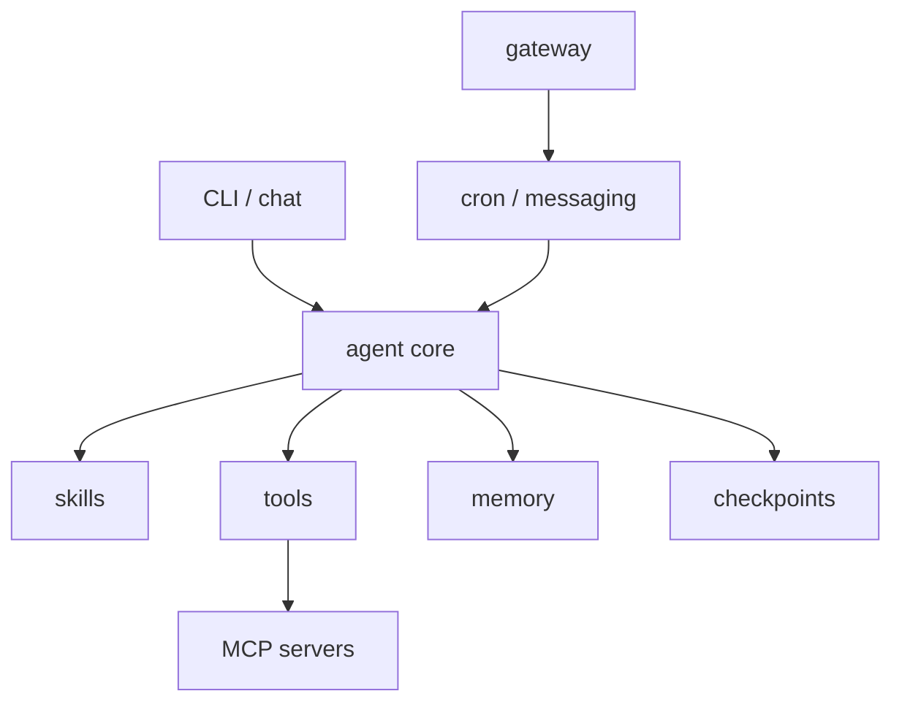
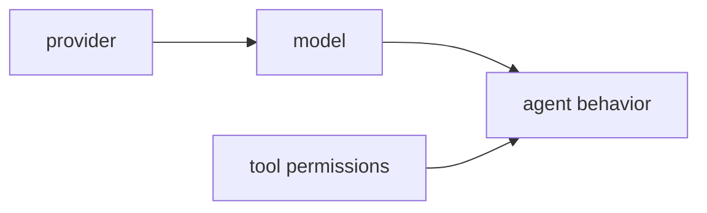
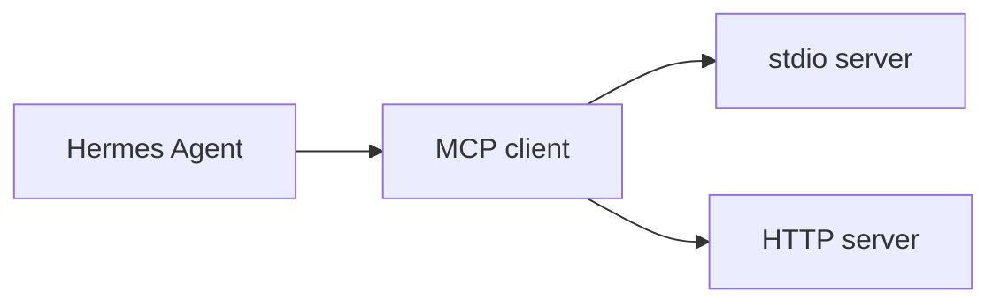
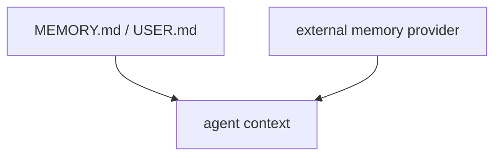
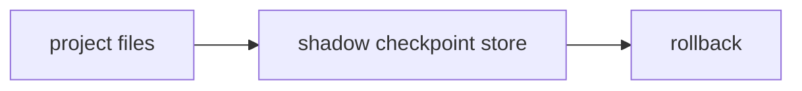
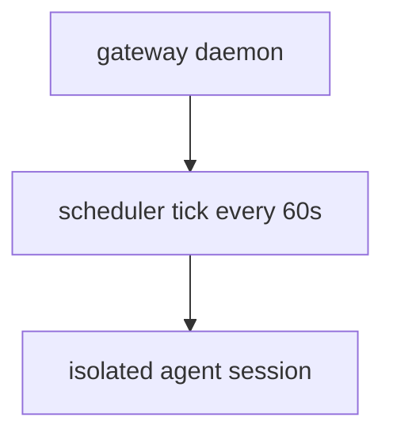

# Figure Roughs

## 図1-1 Hermes Agent の責務分解

## 図3-1 モデル、プロバイダ、ツール権限の関係

## 表5-1 Skill に切り出すべき手順の特徴

| 向いている手順 | 理由 |
| --- | --- |
| 繰り返し使う調査手順 | 毎回説明しなくてよくなる |
| 複数ツールをまたぐ作業 | 再現性が上がる |
| 判断基準を固定したい作業 | ぶれを減らせる |

## 図6-1 MCP で能力を足す流れ

## 表7-1 Profiles、SOUL.md、Context Files の役割

| 要素 | 主な役割 | よくある誤解 |
| --- | --- | --- |
| Profile | state を分離する | sandbox ではない |
| `SOUL.md` | 行動方針を与える | filesystem を制限しない |
| Context Files | プロジェクト前提を渡す | profile の代わりではない |

## 図8-1 built-in memory と external providers の関係

## 図9-1 Checkpoints と rollback の流れ

## 図10-1 Gateway と Cron の長時間運用

## 表11-1 セキュリティと承認のチェックリスト

| 観点 | 確認項目 |
| --- | --- |
| 権限 | どの toolset を許可するか明確か |
| context | secrets を system prompt へ入れすぎていないか |
| rollback | checkpoints を有効にしているか |
| long running | cron / gateway の監視方法があるか |

## 表12-1 Hermes / OpenCode / OpenClaw の比較

| ツール | 強み | 注意点 |
| --- | --- | --- |
| Hermes Agent | stateful 運用基盤が広い | 更新が速い |
| OpenCode | coding workflow に強い | UI / 挙動変化を追う必要がある |
| OpenClaw | プラットフォームの広さ | 対象範囲が広く設計が重い |
