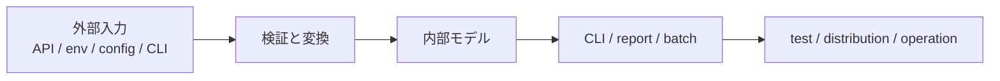
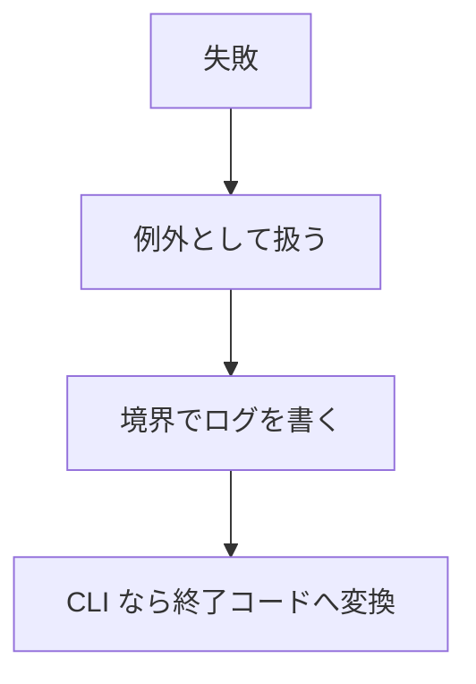
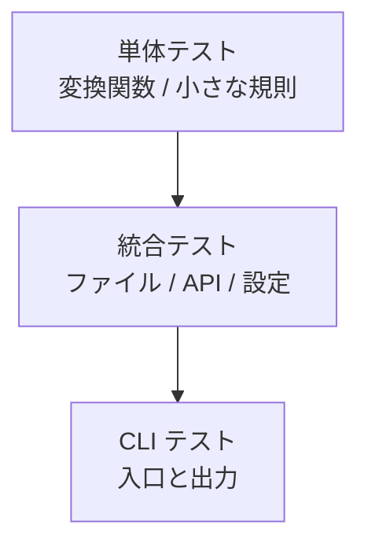
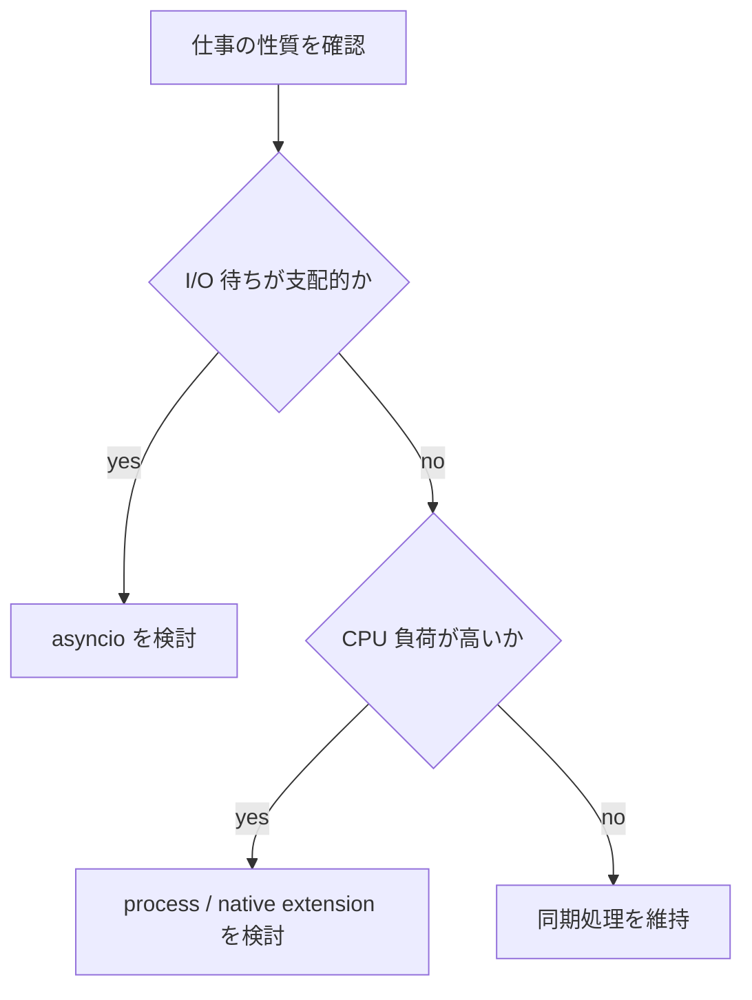
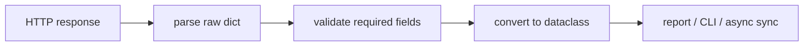

# Figures Final

## 図1-1 Python を運用コードへ育てる流れ

- 図の意図: Python コードが速く書けることと、長く運用できることの間に必要な層を示す
- 本文への接続: 1章の `便利スクリプトで終わらせない` という主張に対応する

## 表4-1 `TypedDict` `dataclass` `Protocol` の使い分け

| 要素 | 向いている場面 | 避けたい場面 |
| --- | --- | --- |
| `TypedDict` | 外部入力の形を表す | 振る舞いを持たせたいとき |
| `dataclass` | 内部モデルを明示したい | 外部スキーマをそのまま持ち込みたいとき |
| `Protocol` | 構造的部分型で契約を表したい | 実体の状態まで固定したいとき |

- 表の意図: Python の型ヒントを厳密さではなく責務で選ぶことを見せる
- 本文への接続: 4章の `型ヒントと読みやすい API 設計` に対応する

## 図5-1 例外、ログ、終了コードの関係

- 図の意図: print と例外と運用ログを混ぜない流れを示す
- 本文への接続: 5章の例外、ログ、CLI をひとつの運用線でまとめる

## 図6-1 テストの層と責務

- 図の意図: テストの役割を層ごとに分け、過剰な結合を避ける
- 本文への接続: 6章の品質管理と回帰防止の考え方に対応する

## 表7-1 `pyproject.toml` を中心に見た依存関係管理

| 対象 | 主な責務 | 代表例 |
| --- | --- | --- |
| `pyproject.toml` | 依存とメタデータの宣言 | project dependencies |
| 仮想環境 | 実行環境の分離 | `.venv` |
| lock | 再現性の固定 | `uv.lock` |
| build backend | 配布物生成 | hatchling, setuptools |

- 表の意図: Python の依存関係管理をツール名ではなく役割で見る
- 本文への接続: 7章の `pyproject.toml`、仮想環境、配布の説明に対応する

## 図8-1 同期処理と非同期処理の選択

- 図の意図: 非同期導入を流行ではなく仕事の性質で判断する
- 本文への接続: 8章の `どこで導入し、どこで止めるか` の判断に対応する

## 表9-1 Python 3.14 の実務上の変化

| 項目 | 何が変わるか | 実務での扱い |
| --- | --- | --- |
| annotations | 遅延評価が標準になる | 反射的利用があるなら確認する |
| subinterpreters | 標準ライブラリに入る | まず用途を限定して試す |
| free-threaded | 公式サポートへ進む | 依存ライブラリの追従を見る |
| `compression.zstd` | 標準ライブラリ追加 | 圧縮ワークフローで有力候補 |

- 表の意図: 新機能を列挙するのではなく採用判断で整理する
- 本文への接続: 9章の `Python 3.14 と実行環境の変化` に対応する

## 図10-1 API レスポンスから内部モデルへの流れ

- 図の意図: 外部レスポンスをそのまま使わない原則を見える化する
- 本文への接続: 4章、5章、10章の話がつながることを示す

## 表11-1 継続運用チェックリスト

| 観点 | 確認項目 |
| --- | --- |
| 設定 | env と config file の責務が分かれているか |
| 境界 | 外部入力を dataclass へ変換しているか |
| テスト | 変換と CLI の両方を押さえているか |
| 更新 | Python と主要依存の更新手順があるか |

- 表の意図: 読後にそのまま使える確認項目を渡す
- 本文への接続: 11章のまとめとして使う
