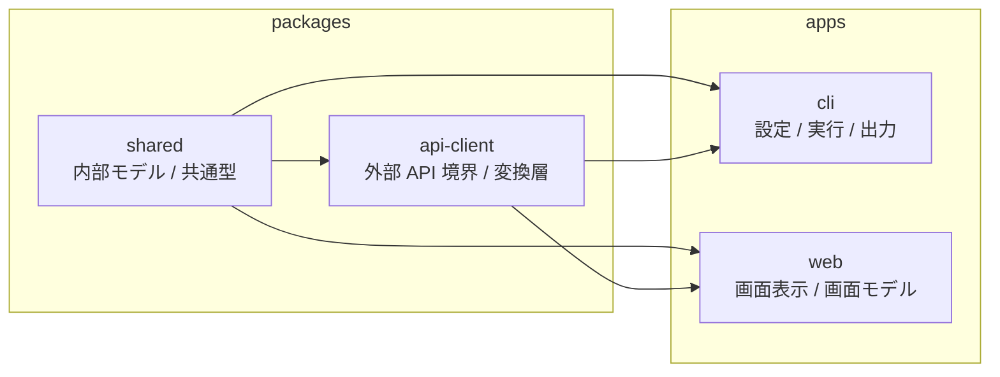
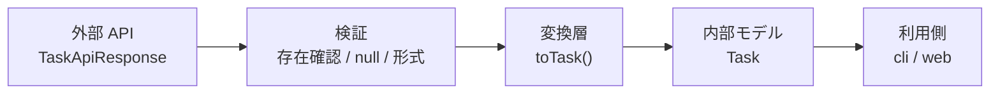
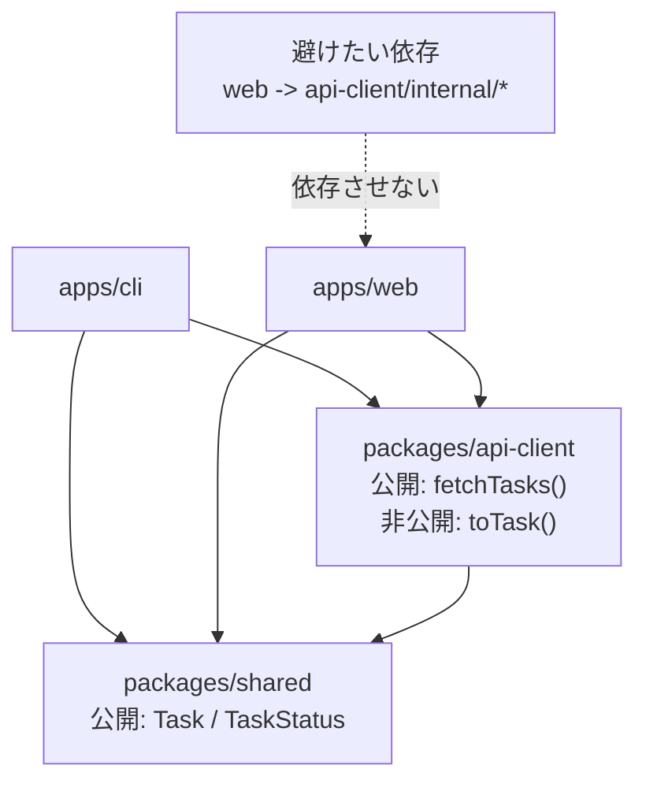
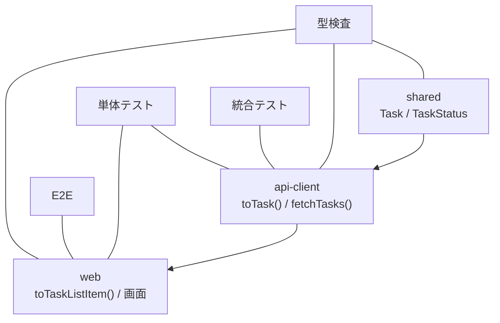
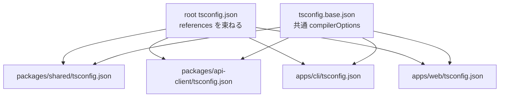
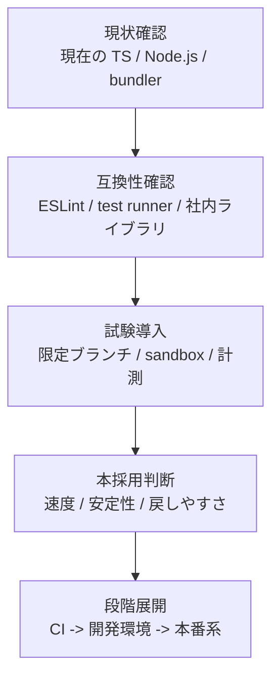

# Figures Final Draft

## このファイルの役割

- 本文へ差し込む図表のうち、清書に近い版をまとめる
- `figures-roughs.md` から、優先度の高い図を先に整える
- KDP 用レイアウトへ渡す前の最終下書きとして使う

## 図1-2

キャプション案: `本書を通して扱う TaskHub の全体構成`

図の意図:

- `shared` を最も内側の土台として見せる
- `api-client` は外部 API 境界であり、`shared` を使って内部モデルへ寄せる層だと示す
- `cli` と `web` は同じ `Task` を使いつつ、責務が異なるアプリケーションだと示す

本文への接続:

- 1章 1-5 で `TaskHub` を初めて紹介する場面
- 付録 A の全体構成とも一致させる

## 図4-1

キャプション案: `TaskHub における外部 API レスポンスから内部モデルへの変換`

図の意図:

- 外部 API の生レスポンスをそのまま使わないことを 1 枚で示す
- `検証` と `変換` を分け、4章の主張を視覚化する
- `Task` が `cli` と `web` の共通前提になることを見せる

本文への接続:

- 4章 4-3 の `toTask()` 直後
- 6章の `fetchTasks()` と 7章の `toTaskListItem()` への伏線になる

## 図5-1

キャプション案: `TaskHub の package 境界と依存方向`

図の意図:

- `shared` と `api-client` の役割差を見せる
- `toTask()` は便利でも公開しないという 5章の主張を図へ落とす
- 深い import を避けるべきだと視覚的に示す

本文への接続:

- 5章 5-1 の `shared` と `TaskApiResponse` の説明直後
- 5章 5-2 の公開 API / 非公開実装の議論にも接続する

## 図8-1

キャプション案: `TaskHub における型検査、単体テスト、統合テスト、E2E の役割分担`

図の意図:

- 型検査とテストの役割が重ならないことを見せる
- `toTask()` と `toTaskListItem()` が、単体テストの価値が高い関数だと示す
- `web` の回帰は E2E まで見ないと分からないことを明確にする

本文への接続:

- 8章 8-1 の `TaskHub` における役割分担直後
- 8章 8-5 の CI ジョブ構成とも対応させる

## 図9-1

キャプション案: `TaskHub における root tsconfig と project references の関係`

図の意図:

- root の `references` と共通設定の分担を分かりやすく示す
- package 境界と設定境界が対応していることを見せる
- `shared` `api-client` `cli` `web` を別設定にする理由を視覚化する

本文への接続:

- 9章 9-3 の root `tsconfig.json` 例直後
- 付録 A の `TaskHub` 構造図とも呼応させる

## 表10-1

キャプション案: `2026年5月12日時点の TypeScript バージョン状況`

| 系列 | 状況 | 本書での位置づけ | 読者への示唆 |
| --- | --- | --- | --- |
| 5.9 | 安定版 | 現行の基準点 | 既存プロジェクトの比較対象 |
| 6.0 | 安定版 | 7.0 への橋渡し | 互換性確認を始める段階 |
| 7.0 Beta | ベータ | 次世代ライン | 実験導入は可、全面採用は慎重に |
| native preview | プレビュー | 速度改善の方向性 | 将来の主戦場を見る材料 |

表の意図:

- 5.9、6.0、7.0 Beta、native preview の立ち位置を一目で整理する
- 本文中の日付と判断軸を、読者が途中で見失わないようにする
- 「最新版紹介」ではなく「移行判断」の章であることを支える

本文への接続:

- 10章 10-2 の公式状況整理直後
- 10章全体の時間前提を固定する

## 図10-1

キャプション案: `TypeScript 更新時の移行判断フロー`

図の意図:

- 更新を技術イベントではなく変更管理として捉えることを示す
- 試験導入と本採用を分けるべきだという 10章の主張を整理する
- 速度だけでなく、可逆性と段階性も判断軸に入ると見せる

本文への接続:

- 10章 10-4 の移行計画説明末尾
- 10章 10-5 の速度と安定性の議論にもつなげる

## 表4-1

キャプション案: `境界ごとに起きやすい壊れ方の比較`

| 境界 | よくある入力 | 壊れやすい点 | 典型的な対策 |
| --- | --- | --- | --- |
| API | JSON レスポンス | `null` 混入、フィールド名変更、部分的不整合 | 検証して内部モデルへ変換する |
| フォーム | 文字列入力 | 数値つもりでも文字列、空文字、想定外操作 | パースとエラー整形を入口で行う |
| 環境変数 | `process.env.*` | 文字列しか来ない、未設定、設定ミス | 起動時に設定型へ変換する |
| CLI 引数 | argv | 必須値欠落、型違い、オプションの揺れ | 引数解析後に妥当性確認する |

表の意図:

- 「境界」とひとことで言っても、壊れ方は同じではないと示す
- 4章で扱う API と環境変数の例を、ほかの入力にも広げて見せる
- 読者が自分のコードのどこを境界として疑うべきかを掴みやすくする

本文への接続:

- 4章 4-2 の 3 段階説明直後
- 付録 B の `外部入力 -> 検証 -> 内部モデル` という流れとも一致させる

## 表5-1

キャプション案: `公開 API と非公開実装を分ける判断基準`

| 要素 | 置き場所 | 原則 | `TaskHub` での例 |
| --- | --- | --- | --- |
| 内部で信頼する型 | 公開してよい | 複数利用側が安定して使う | `Task`, `TaskStatus` |
| 外部 API の生型 | 非公開寄り | 外部仕様の揺れを閉じ込める | `TaskApiResponse` |
| 変換関数 | 非公開寄り | 利用側に責務を漏らさない | `toTask()` |
| 利用入口の関数 | 公開してよい | 呼び出し側に依存してほしい | `fetchTasks()` |

表の意図:

- 「公開してはいけないもの」を単なる感覚ではなく判断軸として示す
- 5章の `shared` と `api-client` の役割差を短く整理する
- `便利だから export する` を避けるための基準を与える

本文への接続:

- 5章 5-2 の説明直後
- 図5-1 の補助として使う

## 表8-1

キャプション案: `TaskHub の CI ジョブ構成と責務`

| ジョブ | 主な対象 | 守るもの | 失敗時に分かること |
| --- | --- | --- | --- |
| `typecheck` | `shared`, `api-client`, `cli`, `web` | 型契約、参照整合性 | どの層で型が崩れたか |
| `test-unit` | `toTask()`, `toTaskListItem()` など | 変換ロジック、境界条件 | 仕様の小さな破れ |
| `test-e2e` | `web` の主要導線 | 画面操作と表示の整合 | 利用者視点の回帰 |

表の意図:

- 図8-1 の役割分担を、CI 実行単位でも確認できるようにする
- 「何が落ちたのか分かる CI」が重要だという 8章の主張を補強する
- 読者が自分のリポジトリでジョブを切るときの雛形にする

本文への接続:

- 8章 8-5 の CI 説明直後
- `pnpm tsc -b`, `vitest`, `playwright` の例と対応させる

## 表9-1

キャプション案: `主要な tsconfig オプションと責務`

| オプション | 主な責務 | どこで効くか | 本書での文脈 |
| --- | --- | --- | --- |
| `strict` | 曖昧さを減らす | 全体 | 型の基準線 |
| `moduleResolution` | import 解決 | Node.js / bundler | 実行前提の整理 |
| `declaration` | 型定義生成 | package 配布 | `shared` の公開面 |
| `composite` | project references 対応 | モノレポ | package 境界とビルド |
| `declarationMap` | 定義元の追跡 | editor / debug | 読みやすさと追跡性 |

表の意図:

- `tsconfig` を呪文ではなく責務で読むための入口にする
- 9章の説明を、設定名の暗記ではなく設計判断へ戻す
- `shared` と `web` の設定差がなぜ必要かを見返しやすくする

本文への接続:

- 9章 9-5 の `packages/shared/tsconfig.json` 例直後
- 図9-1 と合わせて使う

## 清書時の確認

- 矢印の向きが本文の説明と一致しているか
- `shared` `api-client` `cli` `web` の呼称が本文と完全に一致しているか
- 1章の図と 4章・5章の図で、同じ要素の見た目が大きくぶれていないか
- 8章、9章、10章の図表が、本文の箇条書きや表と役割重複しすぎていないか
- 表4-1、表5-1、表8-1、表9-1 が、単なる箇条書きの再掲になっていないか
