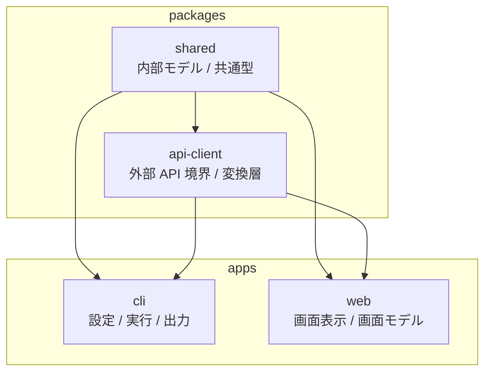
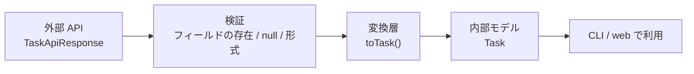
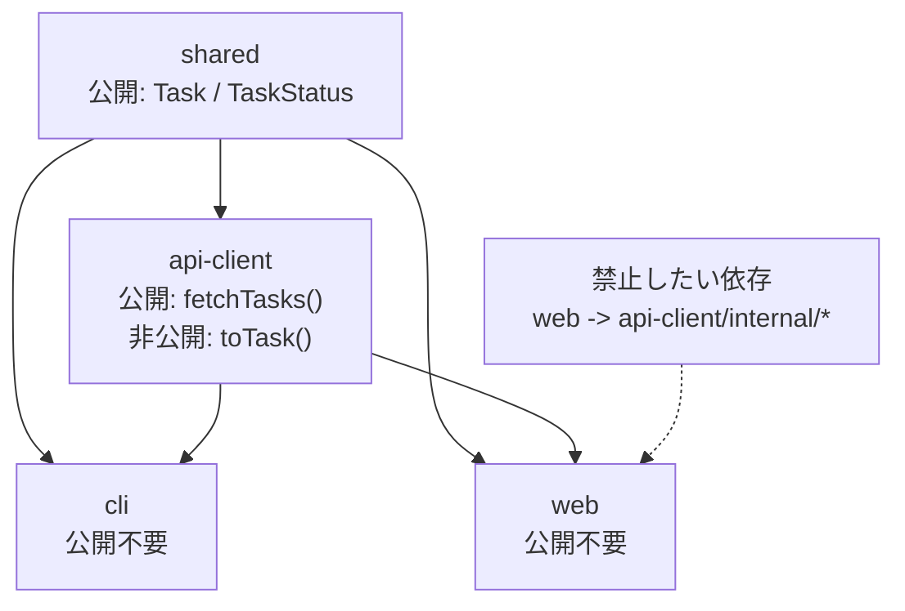
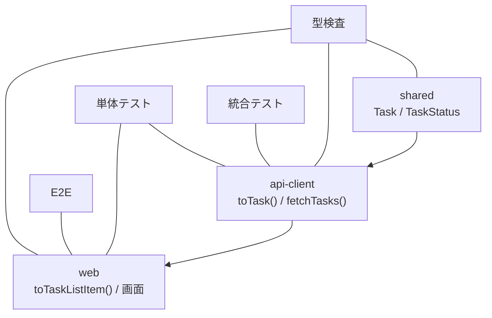
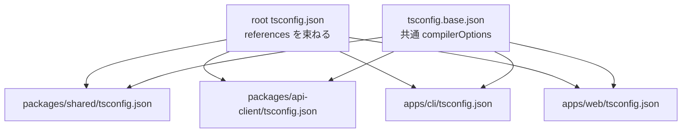
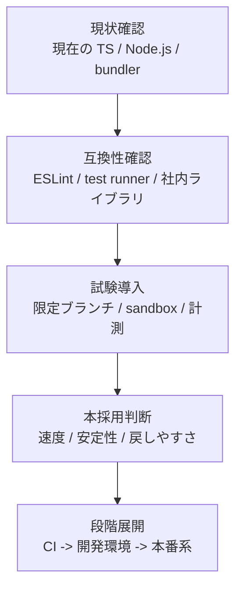

# Figures Roughs

## このファイルの役割

- 本文に差し込む図表のラフを、制作前の下書きとしてまとめる
- キャプション案だけでなく、構造そのものを先に固定する
- 図表の清書時に、本文との対応を見失わないようにする

## 図1-1

キャプション案: `JavaScript の柔軟さが、実務では暗黙の前提を増やし、実行時エラーへつながる流れ`

```mermaid
flowchart LR
  A["外部から値が入る<br/>フォーム / JSON / 環境変数 / DB"] --> B["暗黙の前提<br/>price は number のはず"]
  B --> C["コードは短く書ける<br/>toFixed() をそのまま呼ぶ"]
  C --> D["前提が崩れる<br/>\"100\" / null / undefined"]
  D --> E["実行時エラー<br/>どこで壊れたか追いにくい"]
  B --> F["TypeScript で前提を明示<br/>price: number"]
  F --> G["静的検査で早く気づける<br/>ただし外部入力の検証は別で必要"]
```

使いどころ:

- 1章 1-1 の導入直後
- TypeScript が万能ではなく、暗黙の前提を前に出す道具だと説明する場面

## 図1-2

キャプション案: `本書を通して扱う TaskHub の全体構成`



使いどころ:

- 1章 1-5 の `TaskHub` 紹介直後
- 付録 A への導線にもなる

## 図4-1

キャプション案: `TaskHub における外部 API レスポンスから内部モデルへの変換`



補足メモ:

- `snake_case` から `camelCase`
- 日時文字列から `Date | null`
- `display_name` から `assigneeName`

使いどころ:

- 4章 4-3 の `toTask()` 説明直後
- 6章と7章への橋渡し

## 表4-1

キャプション案: `境界ごとに起きやすい壊れ方の比較`

| 境界 | よくある入力 | 壊れやすい点 | 典型的な対策 |
| --- | --- | --- | --- |
| API | JSON レスポンス | `null` 混入、フィールド名変更、部分的不整合 | 検証して内部モデルへ変換する |
| フォーム | 文字列入力 | 数値つもりでも文字列、空文字、想定外操作 | パースとエラー整形を入口で行う |
| 環境変数 | `process.env.*` | 文字列しか来ない、未設定、設定ミス | 起動時に設定型へ変換する |
| CLI 引数 | argv | 必須値欠落、型違い、オプションの揺れ | 引数解析後に妥当性確認する |

使いどころ:

- 4章 4-2 の 3 段階説明直後

## 図5-1

キャプション案: `TaskHub の package 境界と依存方向`



補足メモ:

- 矢印の向きは「依存する側 -> 依存される側」ではなく、紙面では統一が必要
- 清書時は注記で向きを明示する

使いどころ:

- 5章 5-1 の `shared` / `TaskApiResponse` 説明直後

## 表5-1

キャプション案: `公開 API と非公開実装を分ける判断基準`

| 要素 | 置き場所 | 原則 | `TaskHub` での例 |
| --- | --- | --- | --- |
| 内部で信頼する型 | 公開してよい | 複数利用側が安定して使う | `Task`, `TaskStatus` |
| 外部 API の生型 | 非公開寄り | 外部仕様の揺れを閉じ込める | `TaskApiResponse` |
| 変換関数 | 非公開寄り | 利用側に責務を漏らさない | `toTask()` |
| 利用入口の関数 | 公開してよい | 呼び出し側に依存してほしい | `fetchTasks()` |

使いどころ:

- 5章 5-2 の説明直後

## 図8-1

キャプション案: `TaskHub における型検査、単体テスト、統合テスト、E2E の役割分担`



使いどころ:

- 8章 8-1 の `TaskHub` 分担直後

## 表8-1

キャプション案: `TaskHub の CI ジョブ構成と責務`

| ジョブ | 主な対象 | 守るもの | 失敗時に分かること |
| --- | --- | --- | --- |
| `typecheck` | `shared`, `api-client`, `cli`, `web` | 型契約、参照整合性 | どの層で型が崩れたか |
| `test-unit` | `toTask()`, `toTaskListItem()` など | 変換ロジック、境界条件 | 仕様の小さな破れ |
| `test-e2e` | `web` の主要導線 | 画面操作と表示の整合 | 利用者視点の回帰 |

使いどころ:

- 8章 8-5 の CI 説明直後

## 図9-1

キャプション案: `TaskHub における root tsconfig と project references の関係`



使いどころ:

- 9章 9-3 の root `tsconfig.json` 例直後

## 表9-1

キャプション案: `主要な tsconfig オプションと責務`

| オプション | 主な責務 | どこで効くか | 本書での文脈 |
| --- | --- | --- | --- |
| `strict` | 曖昧さを減らす | 全体 | 型の基準線 |
| `moduleResolution` | import 解決 | Node.js / bundler | 実行前提の整理 |
| `declaration` | 型定義生成 | package 配布 | `shared` の公開面 |
| `composite` | project references 対応 | モノレポ | package 境界とビルド |
| `declarationMap` | 定義元の追跡 | editor / debug | 読みやすさと追跡性 |

使いどころ:

- 9章 9-5 の `packages/shared/tsconfig.json` 例直後

## 表10-1

キャプション案: `2026年5月12日時点の TypeScript バージョン状況`

| 系列 | 状況 | 本書での位置づけ | 読者への示唆 |
| --- | --- | --- | --- |
| 5.9 | 安定版 | 現行の基準点 | 既存プロジェクトの比較対象 |
| 6.0 | 安定版 | 7.0 への橋渡し | 互換性確認を始める段階 |
| 7.0 Beta | ベータ | 次世代ライン | 実験導入は可、全面採用は慎重に |
| native preview | プレビュー | 速度改善の方向性 | 将来の主戦場を見る材料 |

使いどころ:

- 10章 10-2 の公式状況整理直後

## 図10-1

キャプション案: `TypeScript 更新時の移行判断フロー`



使いどころ:

- 10章 10-4 の移行計画説明末尾

## 次に清書したい順

1. 図1-2
2. 図4-1
3. 図5-1
4. 図8-1
5. 図9-1
6. 表10-1
