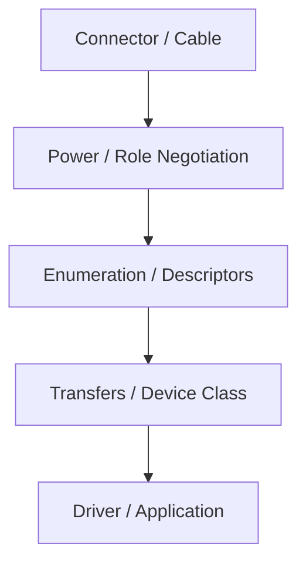
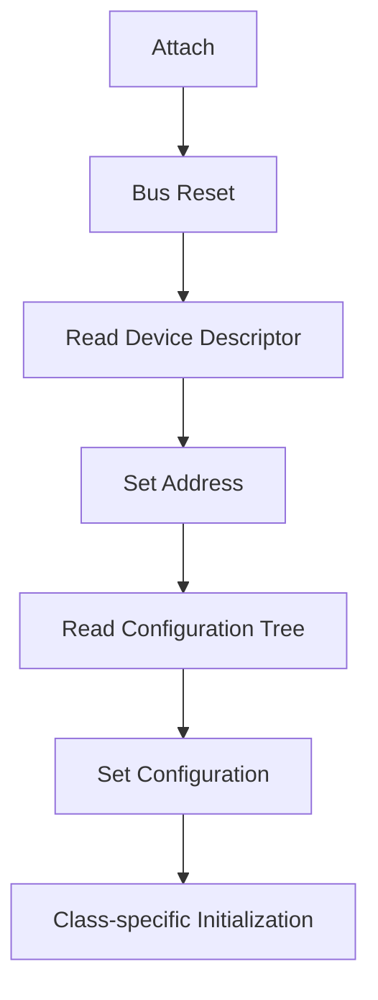
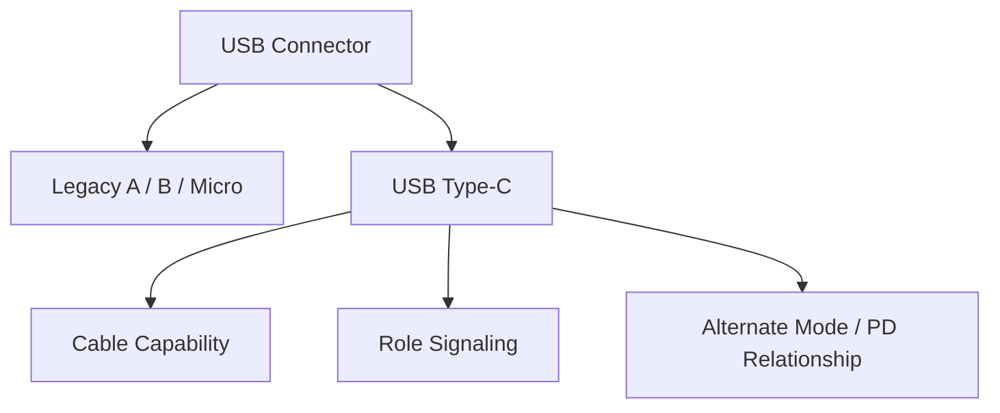
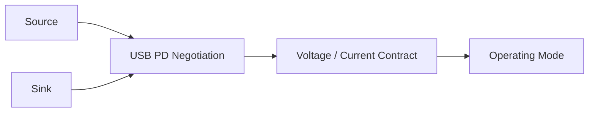
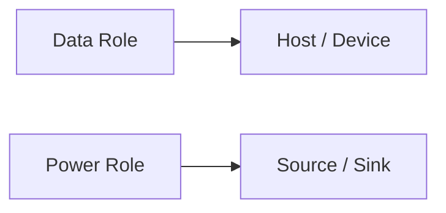
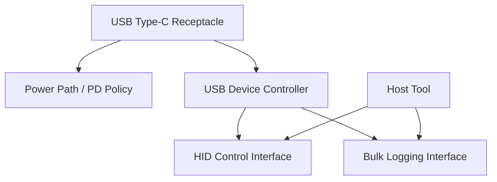
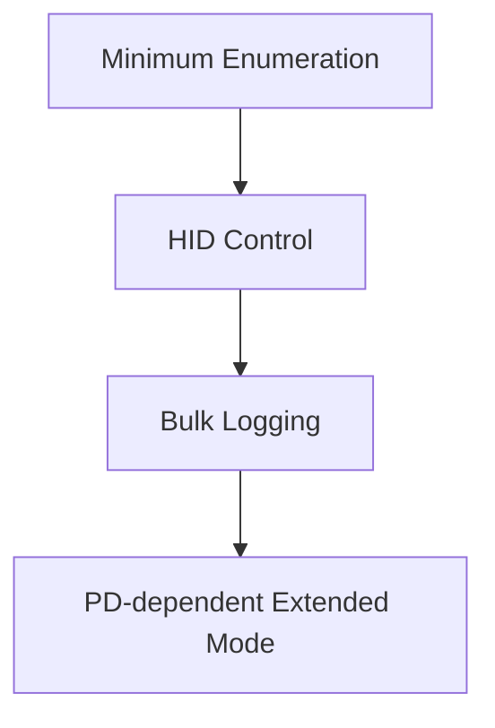
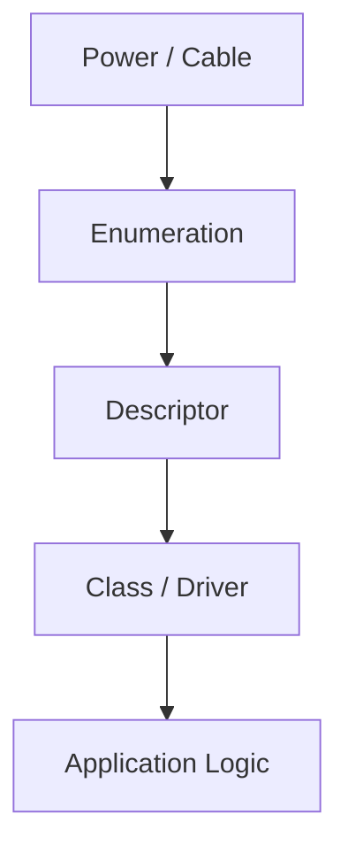
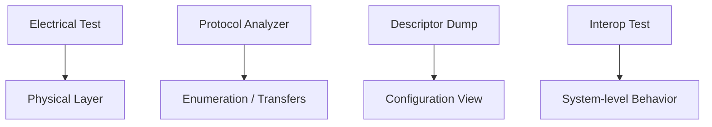

# Figure Finals

## 図1-1 USB を層で見る見取り図

図の意図: USB を connector の話だけにしないための導入図。  
本文への接続: 1章冒頭で、以後の章がどの層を扱うかを示す。

## 図3-1 attach から enumeration までの流れ

図の意図: USB 2.0 仕様 Chapter 9 の説明を、実装者が追える順に簡略化する。  
本文への接続: 3章の enumeration 説明に差し込む。

## 図3-2 control transfer の 3 段階

図の意図: setup / data / status の意味を切り分けて示す。  
本文への接続: 3章で request の読み方を説明する箇所に置く。

## 図5-1 legacy connector と Type-C の切り分け

図の意図: Type-C が単なる形状ではないことを示す。  
本文への接続: 5章前半で legacy connector と Type-C の話を分ける。

## 表5-1 Type-C 採用時に先に固定する条件

表の意図: Type-C を採用しただけで設計判断が終わらないことを示す。  
本文への接続: 5章後半で使う。

| 先に決めること | 例 | 決めないと起きやすいこと |
| --- | --- | --- |
| cable 想定 | 充電専用か高速対応か | 再現しない不具合 |
| power 前提 | default power で成立するか | attach 後の機能不足 |
| data 前提 | USB 2.0 だけか SuperSpeed も必要か | marketing 名称との混線 |
| support 範囲 | hub 経由を含むか | field での説明不足 |

## 図6-1 USB Type-C と USB PD の電力交渉

図の意図: Type-C と PD の関係を誤解しにくくする。  
本文への接続: 6章で source / sink の交渉を説明する箇所に置く。

## 図6-2 power role と data role の切り分け

図の意図: source/sink と host/device を同一視しないための補助図。  
本文への接続: 6章前半で role の違いを説明する箇所に置く。

## 図9-1 `TraceDock` の構成と descriptor の配置

図の意図: 通しサンプル全体を見失わないようにする。  
本文への接続: 9章導入と付録 A 参照の接点に置く。

## 図9-2 `TraceDock` の責務分割

図の意図: 最低限動作、制御、ログ、高負荷機能を段で分けて示す。  
本文への接続: 9章前半の設計方針を説明する箇所に置く。

## 図10-1 debug の切り分け順

図の意図: USB トラブルを層ごとに切り分ける順番を示す。  
本文への接続: 10章冒頭で debug の見取り図として使う。

## 図10-2 試験手段と観測層の対応

図の意図: interop、electrical、protocol analyzer の観測層の違いを示す。  
本文への接続: 10章中盤で試験手段の役割差を説明する箇所に置く。

## 表3-1 主な descriptor の役割

表の意図: descriptor 群の役割差を短く引けるようにする。  
本文への接続: 3章中盤で使う。

| Descriptor | 何を表すか | よく迷う点 |
| --- | --- | --- |
| Device | デバイス全体 | class を device に置くか interface に置くか |
| Configuration | 構成全体 | 電力値や interface 数 |
| Interface | 機能単位 | class / subclass / protocol |
| Endpoint | 転送口 | transfer type と最大パケットサイズ |

## 表3-2 enumeration の停止位置と疑う層

表の意図: どこで止まったかを次の観測点へつなぐ。  
本文への接続: 3章終盤で troubleshooting の入口として使う。

| 停止位置 | まず疑う層 | 次に見るもの |
| --- | --- | --- |
| reset 前後で反応なし | power / cable / PHY | power 条件、port、pull-up |
| device descriptor 途中 | control transfer 実装 | max packet size、応答長 |
| configuration 取得後 | descriptor 整合性 | interface / endpoint tree |
| set configuration 後 | class 初期化 | driver binding、endpoint enable |

## 表4-1 control / bulk / interrupt / isochronous の使い分け

表の意図: 4 種類の転送を用途と性質で比較する。  
本文への接続: 4章終盤で選択指針として使う。

| 転送 | 向いている用途 | 強み | 弱み |
| --- | --- | --- | --- |
| Control | 設定、列挙 | 必須、汎用 | 帯域は小さい |
| Bulk | ログ、ストレージ | 完全性 | 遅延保証は弱い |
| Interrupt | 入力イベント | 周期性 | 大量データには不向き |
| Isochronous | 音声、映像 | 時間優先 | 再送しない |

## 表6-1 power role と data role の組み合わせ

表の意図: source/sink と host/device を混同しないようにする。  
本文への接続: 6章の role 説明で使う。

| power role | data role | ありうる例 |
| --- | --- | --- |
| Source | Host | PC から周辺機器へ給電 |
| Sink | Device | バスパワー機器 |
| Source | Device | 外部電源付きアクセサリ |
| Sink | Host | 電力を受けるノート PC |

## 表6-2 PD 交渉失敗時の典型症状

表の意図: PD 問題を enumeration 問題と混同しないようにする。  
本文への接続: 6章後半の切り分けに使う。

| 症状 | まず疑うもの | 補足 |
| --- | --- | --- |
| attach はするが高機能モードに入らない | contract 不成立 | Type-C attach と PD 成功は別 |
| 高負荷時だけ落ちる | power budget | default power との差を見る |
| cable を変えると改善する | cable capability | device より先に cable を疑う |
| host により結果が違う | source policy | host / charger 側の違いを見る |

## 表8-1 代表的な device class と host 側の見え方

表の意図: class 選択が host 側 UX にどう効くかを短く引けるようにする。  
本文への接続: 8章中盤で使う。

| Class | 典型用途 | host 側での見え方 |
| --- | --- | --- |
| HID | 入力、簡易制御 | driver を用意しやすい |
| CDC | シリアル通信 | 仮想 COM / tty |
| MSC | ストレージ | block device |
| Vendor-specific | 独自機能 | 自前 driver / library |

## 表8-2 `TraceDock` で class を分ける理由

表の意図: class 選択が support と debug にどう効くかを示す。  
本文への接続: 8章後半で `TraceDock` の設計理由を補強する。

| 経路 | class / 方針 | 分ける理由 |
| --- | --- | --- |
| 制御 | HID | 最低限の制御を開きやすくする |
| ログ | Bulk interface | 大きなデータを完全性重視で扱う |
| 拡張 | 必要に応じ vendor-specific | 全体を複雑にしすぎない |

## 表10-1 試験仕様と analyzer の役割差

表の意図: interop、electrical、protocol analyzer の役割を混同しないようにする。  
本文への接続: 10章後半で使う。

| 手段 | 何を見るか | 向いている場面 |
| --- | --- | --- |
| Interop Test | host/device の組み合わせ | 相互接続の再現 |
| Electrical Test | 信号品質 | 物理層問題 |
| Protocol Analyzer | packet / request | 列挙と転送の解析 |
| Descriptor Dump | 構成情報 | class / interface の確認 |

## 表10-2 症状から最初に見る証拠

表の意図: debug の初手を固定する。  
本文への接続: 10章後半で再現条件整理と合わせて使う。

| 症状 | 最初に見る証拠 | その次に見るもの |
| --- | --- | --- |
| まったく認識しない | power / cable 条件 | reset / attach ログ |
| class が違って見える | descriptor dump | interface tree |
| bulk 転送だけ不安定 | transfer log | queue / timeout |
| 高負荷時だけ失敗する | PD / power log | thermal / cable |
