# Figure Finals

## 図1-1 USB の層モデル

図の意図: connector、電力、列挙、転送、OS の話を最初から分ける。
本文への接続: 1章冒頭で、本書全体の地図として置く。

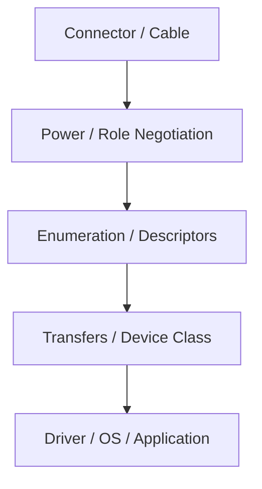

## 図2-1 host、hub、device、interface、endpoint の関係

図の意図: USB を cable 1 本の話ではなく、役割の関係として示す。
本文への接続: 2章前半で role の整理に使う。

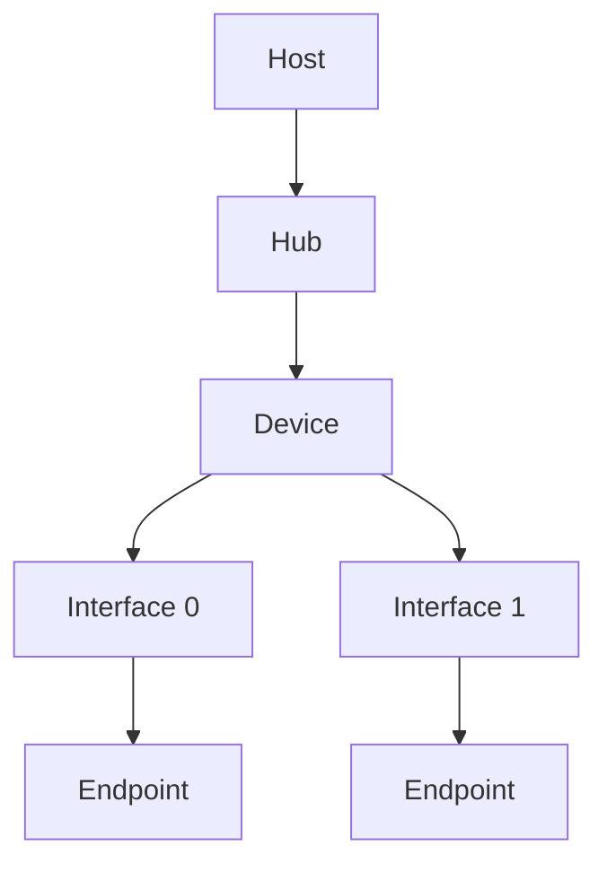

## 図3-1 attach から set configuration まで

図の意図: 列挙が階段状に進むことを示す。
本文への接続: 3章中盤で device framework の流れを説明する箇所に置く。

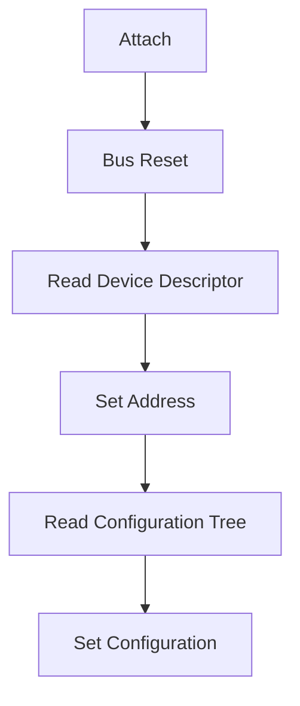

## 図3-2 control transfer の 3 段階

図の意図: setup / data / status stage の境界を見せる。
本文への接続: 3章後半の request 説明に置く。

## 表3-1 列挙停止位置と最初に疑う層

表の意図: どこで止まったかを次の観測点へつなぐ。
本文への接続: 3章終盤で troubleshooting の入口として使う。

| 停止位置 | まず疑う層 | 次に見るもの |
| --- | --- | --- |
| reset 前後で反応なし | power / cable / PHY | power 条件、port、pull-up |
| device descriptor 途中 | control transfer 実装 | `bMaxPacketSize0`、応答長 |
| configuration 取得後 | descriptor 整合性 | interface / endpoint tree |
| set configuration 後 | class 初期化 | driver binding、endpoint enable |

## 図4-1 descriptor 階層の見取り図

図の意図: host が何をどの順で判断するかを視覚化する。
本文への接続: 4章冒頭で descriptor の役割差を示す。

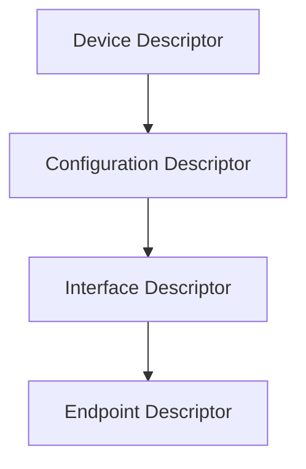

## 表4-1 descriptor ごとに host が決めること

表の意図: 各 descriptor を何の契約として読むかを短く引けるようにする。
本文への接続: 4章後半で使う。

| Descriptor | 主な役割 | host 側で決めること |
| --- | --- | --- |
| Device | device 全体の入口 | 識別、初期列挙条件 |
| Configuration | 全体構成 | interface 数、属性、電力前提 |
| Interface | 機能単位 | class / subclass / protocol |
| Endpoint | 転送口 | transfer type、方向、packet size |

## 図5-1 4 種類の transfer の契約差

図の意図: transfer type を性能表ではなく契約差として示す。
本文への接続: 5章前半で使う。

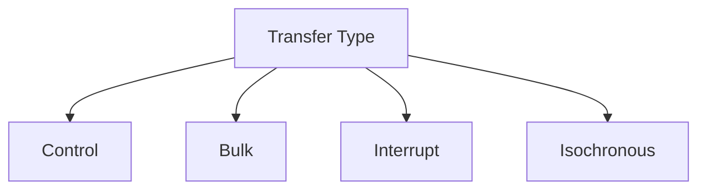

## 表5-1 transfer type の使い分け

表の意図: 4 種類の転送を用途と性質で比較する。
本文への接続: 5章中盤で選択指針として使う。

| 転送 | 向いている用途 | 強み | 弱み |
| --- | --- | --- | --- |
| Control | 列挙、設定 | 必須、汎用 | 帯域は小さい |
| Bulk | 大きなデータ、ログ | 完全性 | 遅延保証は弱い |
| Interrupt | 入力イベント | 周期性 | 大量データには不向き |
| Isochronous | 音声、映像 | 時間優先 | 再送しない |

## 図6-1 class、driver、OS の関係

図の意図: `見える` と `すぐ使える` の差を示す。
本文への接続: 6章冒頭で使う。

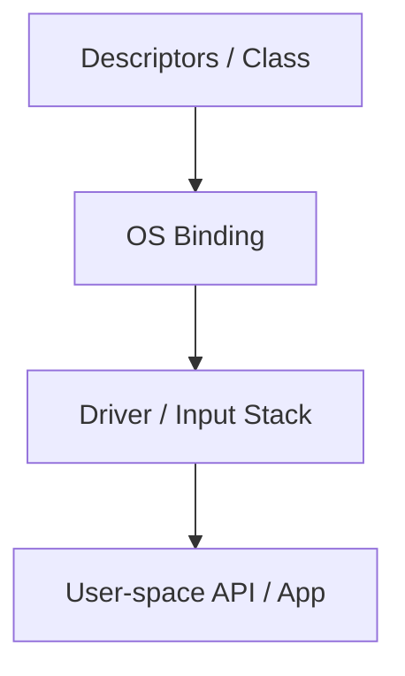

## 表6-1 HID / CDC / MSC / vendor-specific の比較

表の意図: class 選択が support コストへどう効くかを示す。
本文への接続: 6章中盤で使う。

| Class | 典型用途 | 強み | 注意点 |
| --- | --- | --- | --- |
| HID | 入力、簡易制御 | 標準 support が厚い | 複雑機能は外へ逃がしにくい |
| CDC | シリアル風通信 | 人にも機械にも分かりやすい | OS ごとの差に注意 |
| MSC | ストレージ | 直感的に扱いやすい | 責務が重くなる |
| Vendor-specific | 独自機能 | 自由度が高い | host 側負担が増える |

## 図7-1 USB 2.0、USB 3.2、高速 path の重なり

図の意図: 高速側が USB 2.0 の土台を消さないことを示す。
本文への接続: 7章冒頭で使う。

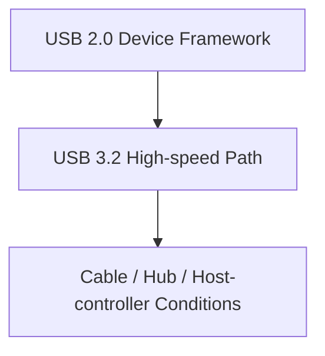

## 表7-1 高速側だけ不安定なときの観測点

表の意図: 高速 path 特有の切り分けを簡潔に示す。
本文への接続: 7章後半で使う。

| 症状 | まず見るもの | 補足 |
| --- | --- | --- |
| USB 2.0 では動く | cable、hub、host controller | 高速 path の環境差を先に切る |
| 速度だけ期待より低い | mode fallback | 互換は成立していても最終 mode は別 |
| dock 経由でだけ崩れる | dock 内部構成 | 単なる延長ではない |

## 図8-1 Type-C の主要信号

図の意図: Type-C を shape ではなく signal 群として示す。
本文への接続: 8章冒頭で使う。

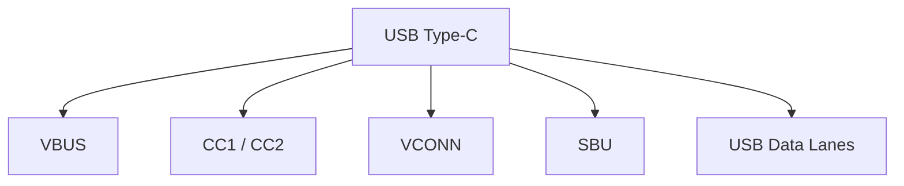

## 図8-2 Rp / Rd / Ra と attach 判定

図の意図: attach 判定の最低限の抵抗モデルを示す。
本文への接続: 8章中盤で使う。

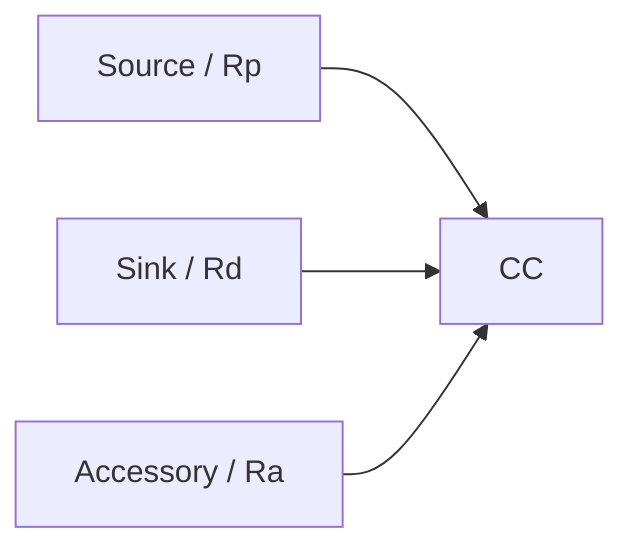

## 表8-1 Type-C で先に固定したい条件

表の意図: Type-C 採用だけでは設計が終わらないことを示す。
本文への接続: 8章後半で使う。

| 先に決めること | 例 | 決めないと起きやすいこと |
| --- | --- | --- |
| cable 想定 | 充電専用か高速対応か | 再現しない不具合 |
| power 前提 | default power で成立するか | attach 後の機能不足 |
| data 前提 | USB 2.0 だけか高速 data も要るか | marketing 名称との混線 |
| support 範囲 | hub / dock 経由を含むか | field での説明不足 |

## 図9-1 Type-C と PD の関係

図の意図: attach と power contract を別イベントとして示す。
本文への接続: 9章冒頭で使う。

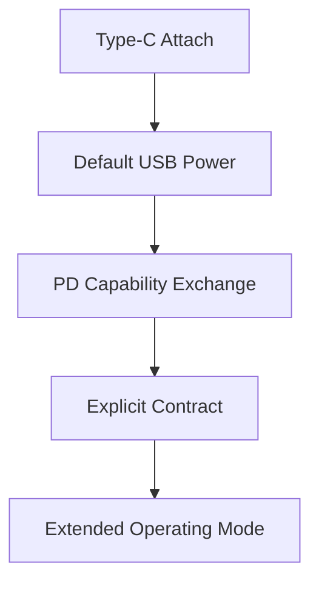

## 表9-1 PD controller が返す代表情報

表の意図: 実務で読みたい status / fault の種類を短く引けるようにする。
本文への接続: 9章後半で使う。

| 種別 | 例 | 役立つ場面 |
| --- | --- | --- |
| status | attach、role、contract | 現在地の把握 |
| capability | source / sink PDO | 交渉前提の確認 |
| fault | hard reset、over-current | 高機能モード不成立の切り分け |
| cable info | e-marker / identity | cable 依存症状の確認 |

## 図10-1 USB4、Thunderbolt 互換、Alt Mode の関係

図の意図: 同じ Type-C 上に複数仕様が重なることを示す。
本文への接続: 10章冒頭で使う。

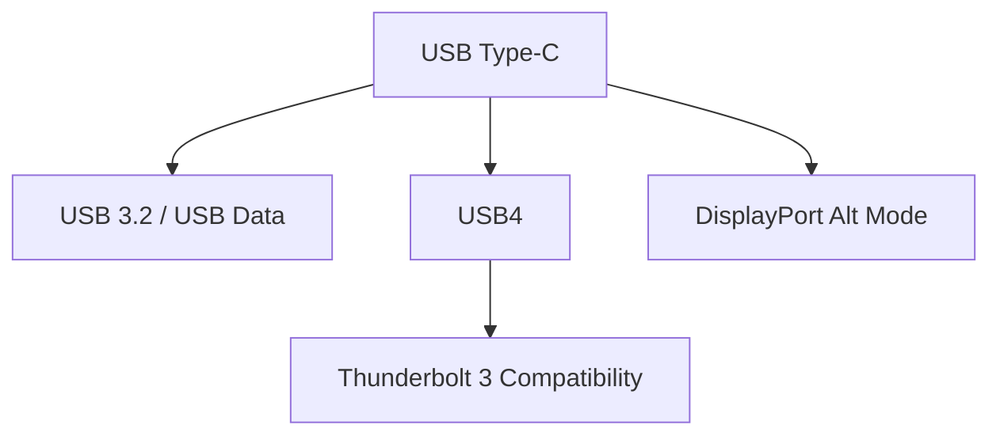

## 表10-1 映像、USB、電力が競合するときの見え方

表の意図: Type-C の `全部同時` が条件依存であることを示す。
本文への接続: 10章後半で使う。

| 症状 | まず疑うもの | 補足 |
| --- | --- | --- |
| 映像は出るが USB が遅い | lane 配分 | Alt Mode と data が同時に走る |
| 給電はあるが映像が出ない | Alt Mode 不成立 | Type-C と映像出力は別仕様 |
| dock によって結果が違う | 内部 mux / retimer / PD | dock は単純延長ではない |

## 図11-1 観測手法と観測層の対応

図の意図: ソフトウェア観測と hardware analyzer の境界を示す。
本文への接続: 11章前半で使う。

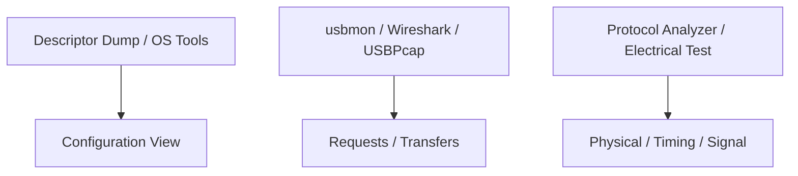

## 表11-1 ソフトウェア観測と analyzer の使い分け

表の意図: どこから先で hardware analyzer が必要かを簡潔に示す。
本文への接続: 11章中盤で使う。

| 手段 | 何を見るか | 向いている場面 |
| --- | --- | --- |
| Descriptor Dump | 構成情報 | class / interface の確認 |
| usbmon / USBPcap | request / response | 列挙と transfer の解析 |
| Wireshark | 可視化と追跡 | software capture の読解 |
| Hardware Analyzer | timing / signal / 高速側 | software capture で届かない層 |

## 表12-1 長期保守で残したい環境情報

表の意図: 保守で必要な再現条件を先に固定する。
本文への接続: 12章中盤で使う。

| 残す情報 | 例 | 役割 |
| --- | --- | --- |
| cable 条件 | 充電専用、高速対応 | 再現性の前提 |
| host 条件 | OS、controller、dock | 環境差の説明 |
| power 条件 | default power、PD contract | 高機能モードの前提 |
| 操作手順 | 失敗する順番 | field 再現の足場 |

## 表D-1 generic HID gamepad でよく見る入力要素

表の意図: ゲームコントローラーを HID の具体例として引けるようにする。
本文への接続: 付録 D で使う。

| 要素 | 典型例 | どこで見るか |
| --- | --- | --- |
| Button | A/B/X/Y、shoulder | report descriptor / input report |
| Axis | X/Y、trigger | usage と logical range |
| Hat Switch | 十字入力 | usage と値の割り当て |
| Feature | 振動、LED など | feature / output report |
