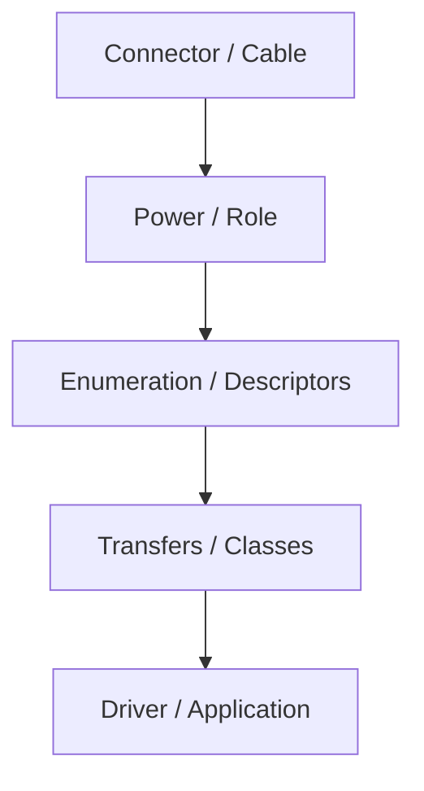
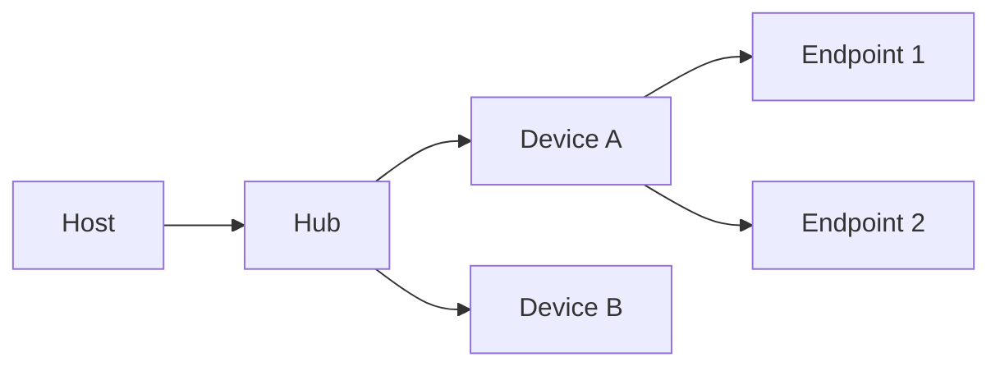
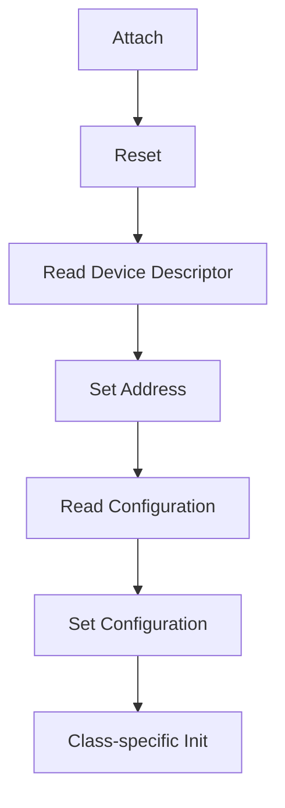
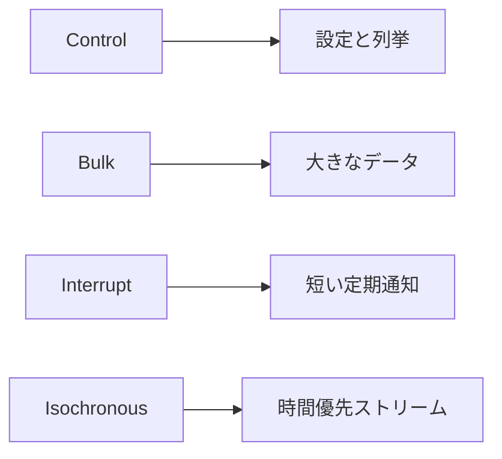
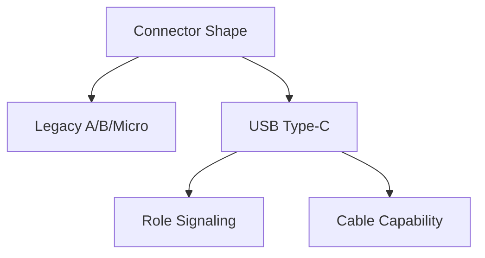
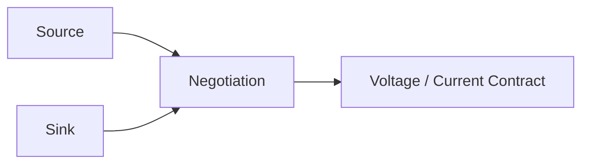
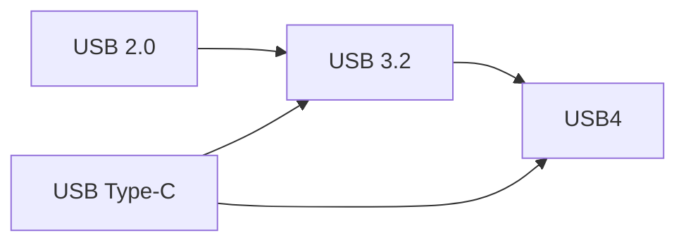
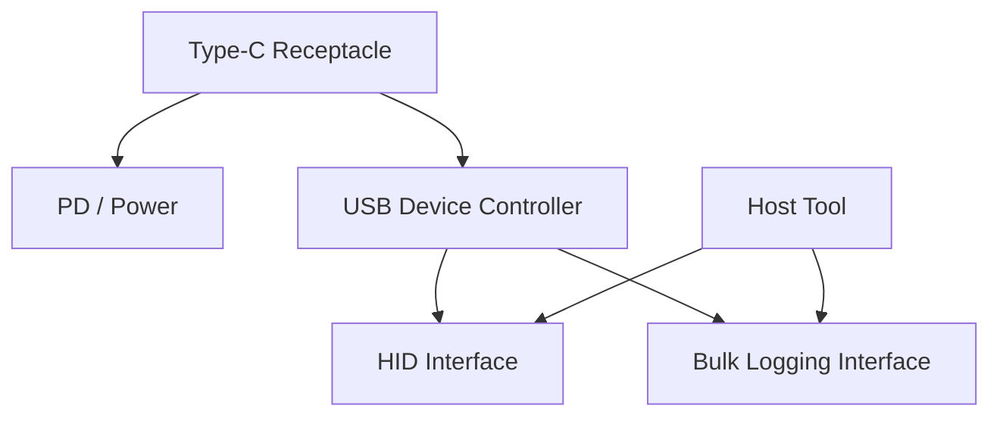
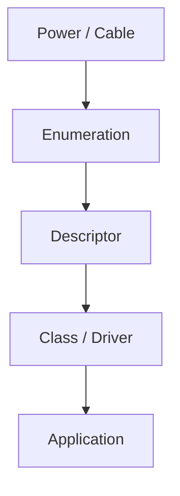

# Figure Roughs

## 図1-1 USB を層で見る見取り図

## 図2-1 host、hub、device、endpoint の関係

## 図3-1 attach から enumeration までの流れ

## 表3-1 主な descriptor の役割

| Descriptor | 何を表すか | よく迷う点 |
| --- | --- | --- |
| Device | デバイス全体 | class を device に置くか interface に置くか |
| Configuration | 構成全体 | 電力値や interface 数 |
| Interface | 機能単位 | class / subclass / protocol |
| Endpoint | 転送口 | transfer type と最大パケットサイズ |

## 図4-1 4 種類の転送方式の比較

## 表4-1 control / bulk / interrupt / isochronous の使い分け

| 転送 | 向いている用途 | 強み | 弱み |
| --- | --- | --- | --- |
| Control | 設定、列挙 | 必須、汎用 | 帯域は小さい |
| Bulk | ログ、ストレージ | 完全性 | 遅延保証は弱い |
| Interrupt | 入力イベント | 周期性 | 大量データには不向き |
| Isochronous | 音声、映像 | 時間優先 | 再送しない |

## 図5-1 legacy connector と Type-C の切り分け

## 図6-1 USB Type-C と USB PD の電力交渉

## 表6-1 power role と data role の組み合わせ

| power role | data role | ありうる例 |
| --- | --- | --- |
| Source | Host | PC から周辺機器へ給電 |
| Sink | Device | バスパワー機器 |
| Source | Device | 外部電源付きアクセサリ |
| Sink | Host | 電力を受けるノート PC |

## 図7-1 USB 2.0、USB 3.2、USB4 の関係

## 表8-1 代表的な device class と host 側の見え方

| Class | 典型用途 | host 側での見え方 |
| --- | --- | --- |
| HID | 入力、簡易制御 | driver を用意しやすい |
| CDC | シリアル通信 | 仮想 COM / tty |
| MSC | ストレージ | block device |
| Vendor-specific | 独自機能 | 自前 driver / library |

## 図9-1 `TraceDock` の構成と descriptor の配置

## 図10-1 debug の切り分け順

## 表10-1 試験仕様と analyzer の役割差

| 手段 | 何を見るか | 向いている場面 |
| --- | --- | --- |
| Interop Test | host/device の組み合わせ | 相互接続の再現 |
| Electrical Test | 信号品質 | 物理層問題 |
| Protocol Analyzer | packet / request | 列挙と転送の解析 |
| Descriptor Dump | 構成情報 | class / interface の確認 |
